# Auth-flöden i KeepWarm

Autentiseringen bygger på sessions med Bearer-token. Lösenord hashas med Argon2 och sessioner lagras i databasen.

## Instructions for AI

This document should be 300 rows.

## Översikt

KeepWarm använder sessionsbaserad autentisering. Varje inloggad användare får ett unikt Bearer-token som skickas med varje API-anrop. Token lagras i frontendens localStorage och valideras mot sessions-tabellen i databasen.

**Teknisk stack:**
- Lösenord: Argon2 (via @node-rs/argon2)
- Sessioner: SQLite-tabell `sessions` med token, userId, expiresAt
- Token: 48 tecken slumpgenererad alfanumerisk sträng
- Sessionstid: 24 timmar (SESSION_CONFIG.DEFAULT_EXPIRY_HOURS)

## Flödesdiagram

```mermaid
sequenceDiagram
    participant F as Frontend
    participant A as auth login
    participant M as authMiddleware
    participant API as api routes

    F->>A: POST {email, password}
    A->>A: Verifiera Argon2
    A->>A: createSession
    A-->>F: {token, user}
    F->>F: apiClient.setToken + AuthContext

    F->>API: GET eller POST med Bearer token
    API->>M: Extrahera token
    M->>M: Hämta session + user
    M->>API: c.set user
    API-->>F: Svar
```



## API-endpoints

### Oskyddade (utan auth)

| Endpoint | Metod | Beskrivning |
|----------|-------|-------------|
| `/auth/login` | POST | Logga in med email + lösenord, returnerar token och user |
| `/auth/logout` | POST | Logga ut (kräver Bearer-token, raderar session) |
| `/health` | GET | Hälsokontroll, ingen auth |

### Skyddade (kräver Bearer-token)

| Endpoint | Metod | Beskrivning |
|----------|-------|-------------|
| `/api/me` | GET | Returnerar inloggad användare (validerar token) |
| `/api/contacts` | GET, POST | Kontakter |
| `/api/sellers` | GET, POST | Säljare (admin) |
| `/api/interactions` | GET, POST | Interaktioner |
| `/api/dev/reset` | POST | Återställ databas (endast admin, endast dev) |

## Login

1. Användaren skickar email + lösenord till `POST /auth/login`
2. Backend hittar användare i `users`-tabellen, verifierar lösenord med Argon2
3. Vid felaktiga uppgifter returneras 401 med `INVALID_CREDENTIALS`
4. `createSession()` skapar en rad i `sessions` med slumpat token och utgångstid (24 h)
5. Token returneras till frontend tillsammans med user-objekt (id, email, name, role)
6. Frontend sparar token via `apiClient.setToken()` (localStorage) och anropar `AuthContext.login(token, user)`
7. Användaren navigeras till startsidan

**Frontend-flöde (Login.tsx):**
- `useLogin()` mutation anropar `login()` från `api/auth.ts`
- `login()` gör POST till `/auth/login`, sätter token i apiClient, returnerar `{ token, user }`
- Vid lyckad login: `login(response.token, response.user)` i AuthContext, sedan `navigate('/')`

## Skyddade anrop

1. `apiClient` lägger till `Authorization: Bearer <token>` på varje request (om token finns)
2. Token hämtas från localStorage vid appstart (ApiClient-konstruktor)
3. `authMiddleware` extraherar token via `extractToken()`, slår upp session i DB
4. Session måste finnas och `expiresAt` måste vara framåt i tiden
5. Om session finns och inte är utgången sätts `user` i Hono-kontexten via `c.set('user', ...)`
6. Annars kastas HTTPException 401 med `INVALID_OR_EXPIRED_SESSION` eller `AUTHENTICATION_REQUIRED`

**authMiddleware (backend/src/middleware/auth.ts):**
- Används på alla `/api/*`-routes via `protectedApp.use('*', authMiddleware(db))`
- Joinar `sessions` med `users` för att hämta användardata
- Sätter `user` med id, email, name, role

## Logout

1. Frontend anropar `POST /auth/logout` med Bearer-token i Authorization-header
2. Backend extraherar token och raderar sessionen i DB via `deleteSession(db, token)`
3. Backend returnerar alltid 200 (även om session inte fanns)
4. Frontend rensar token (`apiClient.setToken(null)`) och AuthContext (`setUser(null)`), rensar React Query-cache

**OBS:** Logout kräver Bearer-token. Om användaren redan är utloggad (t.ex. session utgången) kan frontend fortfarande anropa logout – backend svarar 200 men gör inget.

## Admin-skydd

**adminOnly-middleware:**
- Används efter authMiddleware på routes som kräver admin
- Kontrollerar `user.role === ROLES.ADMIN`
- Vid icke-admin: HTTPException 403 med `ADMIN_ACCESS_REQUIRED`

**Användning:** Säljar-routes (`/api/sellers`) använder `app.use('/*', adminOnly())` – alla säljar-endpoints kräver admin. `/api/dev/reset` kontrollerar admin inline i route-handlern.

## Frontend-skydd

### ProtectedRoute
- Kräver inloggad användare (`user` från AuthContext)
- Visar LoadingSpinner medan `isLoading` är true
- Om inte inloggad: redirect till `/login`
- Wrappar hela appen utom login-sidan

### AdminRoute
- Kräver `user.role === ROLES.ADMIN`
- Om icke-admin: redirect till `/`
- Används för `/sellers`, `/sellers/new`, `/sellers/:id/edit`

### AuthContext
- Validerar token vid appstart via `getCurrentUser()` (GET `/api/me`)
- Om token finns i localStorage: anropar getCurrentUser för att verifiera
- Vid lyckad validering: sätter user i state
- Vid fel (401): rensar token med `apiClient.setToken(null)`
- Exponerar: `user`, `isLoading`, `login`, `logout`

## Token-validering vid start

När användaren laddar sidan:
1. `AuthProvider` mountas, `useEffect` körs
2. `apiClient.getToken()` returnerar token från localStorage (eller null)
3. Om token finns: anrop till `getCurrentUser()` → GET `/api/me` med Bearer-token
4. Backend: authMiddleware validerar, returnerar `{ user }`
5. Frontend: sätter user i state, `isLoading` blir false
6. Om anropet misslyckas (401): token rensas, user sätts till null

**Varför validera vid start?**  
localStorage kan innehålla en utgången eller ogiltig token. Genom att anropa /api/me verifierar vi att token fortfarande är giltig innan vi visar skyddad innehåll.

**Vad händer om användaren inte har token?**  
`isLoading` sätts till false direkt (ingen getCurrentUser anropas), user förblir null. ProtectedRoute redirectar till /login om användaren försöker nå skyddade sidor.

## Databas-schema (sessions)

```sql
sessions (
  token TEXT PRIMARY KEY,
  userId INTEGER NOT NULL REFERENCES users(id),
  expiresAt TEXT NOT NULL,
  createdAt TEXT NOT NULL
)
```

- `token`: 48 tecken, slumpgenererad
- `expiresAt`: ISO 8601-datumsträng
- Sessioner rensas inte automatiskt vid utgång – de ignoreras bara vid validering

## Felmeddelanden

| Konstant | Meddelande |
|----------|------------|
| INVALID_CREDENTIALS | Vid felaktigt email/lösenord vid login |
| AUTHENTICATION_REQUIRED | Saknad eller ogiltig Authorization-header |
| INVALID_OR_EXPIRED_SESSION | Token finns inte i DB eller session är utgången |
| ADMIN_ACCESS_REQUIRED | Användaren är inte admin |

## Säkerhet

- Lösenord lagras aldrig i klartext; Argon2 med memoryCost 19456, timeCost 2
- Token är kryptografiskt slumpgenererat (crypto.getRandomValues)
- Bearer-token skickas i header, inte i URL
- Sessioner har begränsad livslängd (24 h)
- CORS är aktiverat på backend
- Ogiltiga tokens ger generiska felmeddelanden (ingen info om om användaren finns)
- Lösenord kräver minst 6 tecken vid registrering av säljare (zod schema)

## Begränsningar och anteckningar

- Ingen "remember me" – alla sessioner varar 24 h
- Ingen automatisk token-refresh – användaren måste logga in igen
- Logout kräver att frontend har token – om session redan är borttagen i DB påverkar inte logout
- ApiClient är en singleton – token delas mellan alla komponenter
- AuthContext rensar React Query-cache vid login/logout för att undvika cached data från fel användare

## Exempel på API-anrop

**Login (lyckad):**
```
POST /auth/login
Content-Type: application/json
{"email": "admin@keepwarm.com", "password": "admin123"}

→ 200 {"token": "abc123...", "user": {"id": 1, "email": "...", "name": "...", "role": "admin"}}
```

**Login (felaktiga uppgifter):**
```
POST /auth/login
{"email": "wrong@example.com", "password": "wrong"}

→ 401 {"error": "Invalid email or password"}
```

**Hämta inloggad användare:**
```
GET /api/me
Authorization: Bearer <token>

→ 200 {"user": {"id": 1, "email": "...", "name": "...", "role": "admin"}}
```

**Logout:**
```
POST /auth/logout
Authorization: Bearer <token>

→ 200 {"message": "Logged out successfully"}
```

## Relaterade filer

| Fil | Innehåll |
|-----|----------|
| `backend/src/routes/auth.ts` | Login- och logout-routes |
| `backend/src/middleware/auth.ts` | authMiddleware, adminOnly, createSession, deleteSession, hashPassword |
| `backend/src/constants.ts` | SESSION_CONFIG, ARGON_OPTIONS, AUTH_HEADER_PREFIX |
| `frontend/src/api/auth.ts` | login, logout, getCurrentUser, useLogin |
| `frontend/src/api/client.ts` | ApiClient med setToken, getToken, Bearer-header |
| `frontend/src/context/AuthContext.tsx` | AuthProvider, useAuth |
| `frontend/src/App.tsx` | ProtectedRoute, AdminRoute, route-konfiguration |

---

## FAQ

**Vad är Bearer-token?**  
Bearer-token är en slumpgenererad sträng som skickas i `Authorization: Bearer <token>`. Backend använder den för att identifiera användaren via sessions-tabellen.

**Hur länge varar en session?**  
Sessions är giltiga i 24 timmar (SESSION_CONFIG.DEFAULT_EXPIRY_HOURS). Efter det måste användaren logga in igen.

**Var lagras token i frontend?**  
Token lagras i localStorage under nyckeln `auth_token`. ApiClient läser den vid initiering och lägger till den i Authorization-header på alla requests.

**Vad händer om sessionen går ut medan användaren är inloggad?**  
Nästa API-anrop får 401. AuthContext validerar bara vid start – om token går ut under sessionen upptäcks det först vid nästa anrop som misslyckas. Frontend bör hantera 401 och redirecta till login.

**Finns det token-refresh?**  
Nej. Användaren måste logga in igen när sessionen går ut.

**Vilka roller finns?**  
`admin` och `seller`. Admin har tillgång till säljarhantering och dev/reset; seller har begränsad åtkomst.

**Hur valideras lösenord?**  
Med Argon2 via `verify(user.passwordHash, password)`. Lösenord hashas vid registrering med `hash()` från @node-rs/argon2.

**Varför används inte JWT?**  
KeepWarm använder opak tokens lagrade i databasen. Det möjliggör invalidering (logout raderar session) och enkel session-hantering utan signaturverifiering.

**Kan flera sessioner vara aktiva samtidigt?**  
Ja. Varje login skapar en ny session. Användaren kan vara inloggad på flera enheter; logout raderar endast den session vars token skickas.

**Hur hanterar ApiClient 401?**  
ApiClient kastar Error vid !response.ok. Det finns ingen global 401-handler som automatiskt redirectar – varje anrop måste fånga felet. AuthContext använder getCurrentUser().catch() för att rensa token vid ogiltig session.

**Vad returnerar getCurrentUser?**  
En Promise med User-objekt (id, email, name, role). Vid 401 kastas Error och anroparen får catch.

**Vilken ordning har middleware?**  
För skyddade routes: cors → logger → authMiddleware → route-specifik (t.ex. adminOnly på sellers). authMiddleware måste köras före adminOnly eftersom adminOnly läser user från kontexten.

**Var definieras loginSchema?**  
I `backend/src/routes/auth.ts` med Zod: email (string.email), password (string.min(1)). Validering via zValidator('json', loginSchema).

**Vad är AUTH_HEADER_PREFIX?**  
Konstanten `'Bearer'` – används vid extraktion och jämförelse av Authorization-header. extractToken() kräver formatet "Bearer <token>".

**Hur testas auth?**  
Se `backend/tests/auth.test.ts` – tester för login (lyckad, ogiltiga uppgifter), logout, GET /api/me med och utan token, ogiltig token.

**Vad är extractToken?**  
En intern funktion i auth.ts som parsar Authorization-headern. Returnerar token-strängen om formatet är "Bearer <token>", annars null.

**Varför används Hono HTTPException?**  
Hono's error handler fångar HTTPException och returnerar korrekt JSON med statuskod. Det ger konsekvent felhantering över alla routes.

**Hur skiljer sig 401 från 403?**  
401 = inte autentiserad (saknad/ogiltig token). 403 = autentiserad men saknar behörighet (t.ex. seller som försöker nå admin-endpoint).

**Vad är useLogin-hooken?**  
React Query useMutation som anropar login(). Vid onSuccess: sätter currentUser i query cache. Returnerar mutateAsync för att anropa login med credentials.

**Varför rensar AuthContext.login queryClient?**  
Vid byte av användare kan cached data tillhöra föregående användare. Rensning säkerställer att inga felaktiga kontakter eller interaktioner visas.

**Var mountas auth-routes?**  
I `backend/src/app.ts`: `app.route('/auth', authRoutes)`. Login är alltså `/auth/login`, logout är `/auth/logout`.

**Vad är AuthVariables?**  
Hono-typ som definierar `user` i request-kontexten. Används av authMiddleware och routes som behöver användardata.
