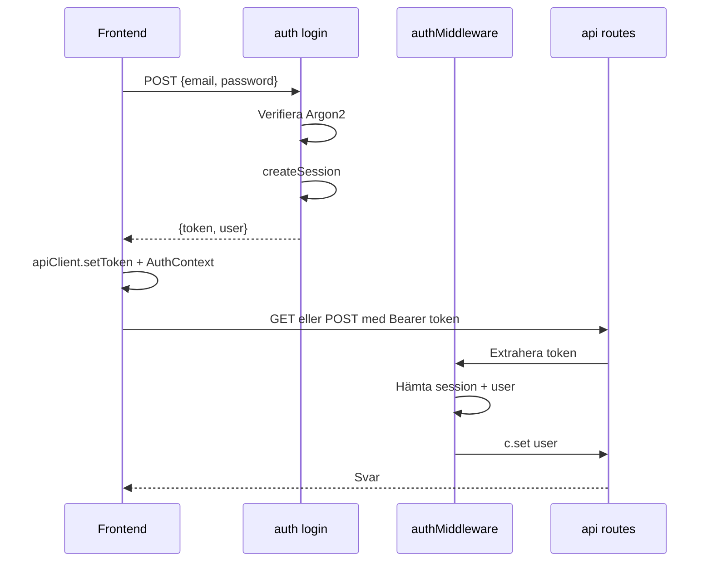

# Auth-flöden i KeepWarm

Autentiseringen bygger på sessions med Bearer-token. Lösenord hashas med Argon2 och sessioner lagras i databasen.

## Flödesdiagram

## Login

1. Användaren skickar email + lösenord till `POST /auth/login`
2. Backend hittar användare, verifierar lösenord med Argon2
3. `createSession()` skapar en rad i `sessions` med slumpat token och utgångstid (24 h)
4. Token returneras till frontend
5. Frontend sparar token via `apiClient.setToken()` (localStorage) och AuthContext

## Skyddade anrop

1. `apiClient` lägger till `Authorization: Bearer <token>` på varje request
2. `authMiddleware` extraherar token, slår upp session i DB
3. Om session finns och inte är utgången sätts `user` i kontexten
4. Annars returneras 401

## Logout

1. Frontend anropar `POST /auth/logout` med Bearer-token
2. Backend raderar sessionen i DB via `deleteSession`
3. Frontend rensar token (apiClient.setToken(null)) och AuthContext

## Frontend-skydd

- `ProtectedRoute` – kräver inloggad användare, annars redirect till `/login`
- `AdminRoute` – kräver `role === 'admin'`, annars redirect till `/`
- `AuthContext` validerar token vid start via `getCurrentUser` (GET /api/me)

---

## FAQ

**Vad är Bearer-token?**  
Bearer-token är en slumpgenererad sträng som skickas i `Authorization: Bearer <token>`. Backend använder den för att identifiera användaren via sessions-tabellen.

**Hur länge varar en session?**  
Sessions är giltiga i 24 timmar (SESSION_CONFIG.DEFAULT_EXPIRY_HOURS). Efter det måste användaren logga in igen.
