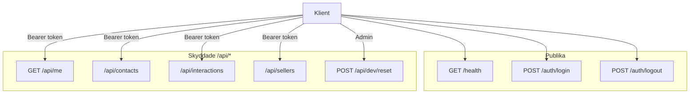

# Backend – KeepWarm CRM

## Översikt

Backend är en REST API byggd med Hono, Node.js och SQLite via Drizzle ORM. Servern kör på port 3000 (konfigurerbar via `PORT`). Autentisering sker via sessionstokens i `Authorization: Bearer <token>`. Teknisk stack inkluderar Hono som webbramverk, Drizzle ORM för databasåtkomst, @node-rs/argon2 för lösenordshashing, Zod för validering och @hono/zod-validator för integration med Hono.

## API-struktur

Publika endpoints är `/health`, `/auth/login` och `/auth/logout`. Alla `/api/*`-endpoints kräver Bearer token. authMiddleware läser token, slår upp session i `sessions`-tabellen och kräver att `expiresAt > now`. adminOnly kräver `user.role === 'admin'`.

## Endpoints

Auth: `POST /auth/login` (email + password → token + user), `POST /auth/logout` (invaliderar session). Skyddade: `GET /api/me`, `GET/POST/PUT/DELETE /api/contacts`, `POST /api/contacts/bulk` (bulk-import), `GET /api/contacts/wastebin`, `POST /api/contacts/:id/restore`, `DELETE /api/contacts/:id/permanent`, `GET/POST/PUT/DELETE /api/interactions`, `GET/POST/PUT/DELETE /api/sellers`. `POST /api/dev/reset` återställer och seedar databas (admin, endast NODE_ENV !== production).

Admin har full åtkomst. Säljare ser endast egna kontakter och interaktioner (`sellerId === user.id`). Zod-scheman validerar create/update. `followUpDate` och `date` kräver format `YYYY-MM-DD`. LinkedIn normaliseras till användarnamn. HTTPException används för 401/403/404/500. CORS är aktiverat globalt.
