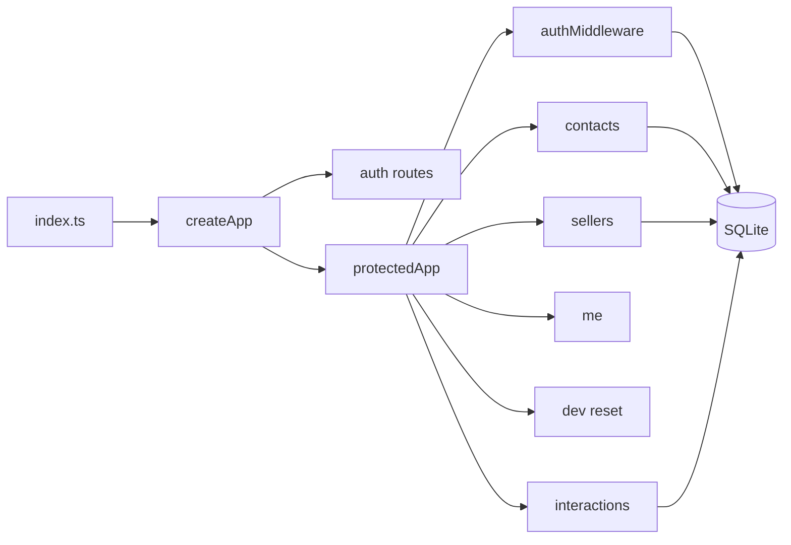

# KeepWarm Backend

Backend är en REST API byggd med Hono, Drizzle ORM och SQLite. Den kör på port 3000 (standard).

## Struktur

## Filer och ansvar

| Fil | Ansvar |
|-----|--------|
| `src/index.ts` | Startar servern, kör migrationer, seed vid SEED_DB |
| `src/app.ts` | Skapar Hono-app, CORS, routes, felhantering |
| `src/db/schema.ts` | Tabeller: users, sessions, contacts, interactions |
| `src/middleware/auth.ts` | Bearer-token, session-validering, adminOnly, createSession, deleteSession |
| `src/routes/auth.ts` | POST auth login, POST auth logout |
| `src/routes/contacts.ts` | CRUD + wastebin, restore, permanent delete |
| `src/routes/sellers.ts` | Säljarhantering (admin) |
| `src/routes/interactions.ts` | Interaktioner per kontakt |

## API-endpoints

**Öppna:** `/health`, `/health/stream` (SSE), `/auth/login`, `/auth/logout`

**Skyddade (Bearer):** `/api/me`, `/api/contacts`, `/api/sellers`, `/api/interactions`, `/api/dev/reset` (admin, dev)

## Databasschema

- **users:** id, email, passwordHash, name, role (admin/seller), createdAt, updatedAt
- **sessions:** id, token, userId, expiresAt, createdAt
- **contacts:** sellerId, name, email, phone, company, linkedin, followUpDate, deletedAt, createdAt, updatedAt
- **interactions:** contactId, sellerId, type (call, meeting, email, video_call, note), date, time, notes, createdAt, updatedAt

## Åtkomstregler

Säljare ser endast egna kontakter och interaktioner. Admins ser allt. `/api/sellers` och `/api/dev/reset` kräver admin.

---

## FAQ

**Vad är Drizzle ORM?**  
Drizzle är ett TypeScript-ORM som används för schema-definition och SQL-frågor mot SQLite. Migrationer hanteras med drizzle-kit.

**Varför används Argon2?**  
Argon2 används för att hasha lösenord. Det är en säker hash-algoritm rekommenderad för lösenordslagring som skyddar mot brute-force-attacker.
