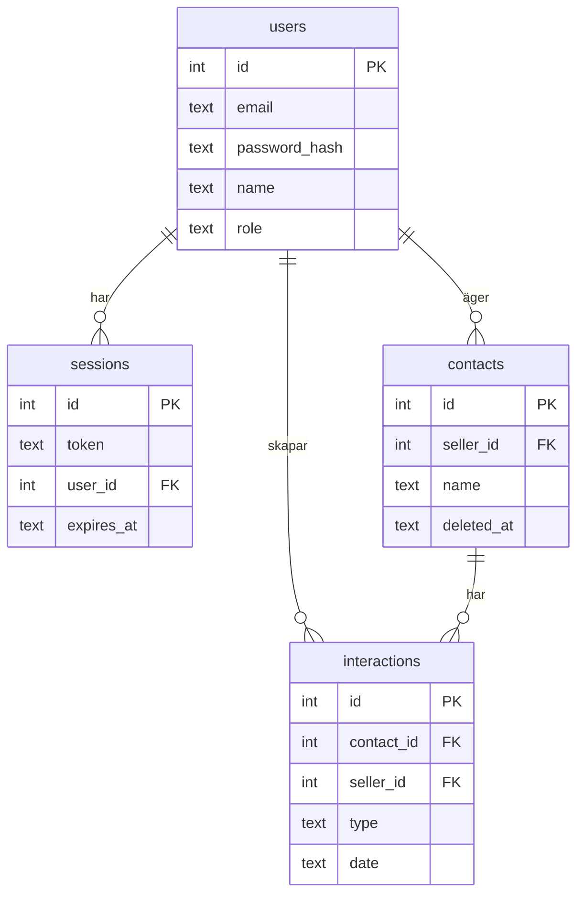

# Databas – KeepWarm CRM

## Översikt

Databasen använder SQLite med Drizzle ORM. Schemat definieras i `backend/src/db/schema.ts` och migrationer körs vid serverstart. Med `SEED_DB=true` nollställs databasen och seedas med testdata (säljare, kontakter, interaktioner).

## Tabeller

**users** – Användare (säljare och admins). Kolumner: id (PK), email (UNIQUE), password_hash (Argon2), name, role ('admin' | 'seller'), created_at, updated_at.

**sessions** – Sessioner för autentisering. Kolumner: id (PK), token (UNIQUE), user_id (FK → users), expires_at, created_at.

**contacts** – Kontakter kopplade till en säljare. Soft delete via `deleted_at`. Kolumner: id (PK), seller_id (FK → users), name, email, phone, company, linkedin (användarnamn, ej full URL), follow_up_date (YYYY-MM-DD), deleted_at, created_at, updated_at.

**interactions** – Interaktioner kopplade till kontakt och säljare. Kolumner: id (PK), contact_id (FK → contacts), seller_id (FK → users), type (call, meeting, email, video_call, note), date (YYYY-MM-DD), time, notes, created_at, updated_at.

## Relationer

Cascade: sessions.user_id, contacts.seller_id, interactions.contact_id och interactions.seller_id har alla ON DELETE CASCADE, så att radering av en användare eller kontakt automatiskt rensar tillhörande poster.
