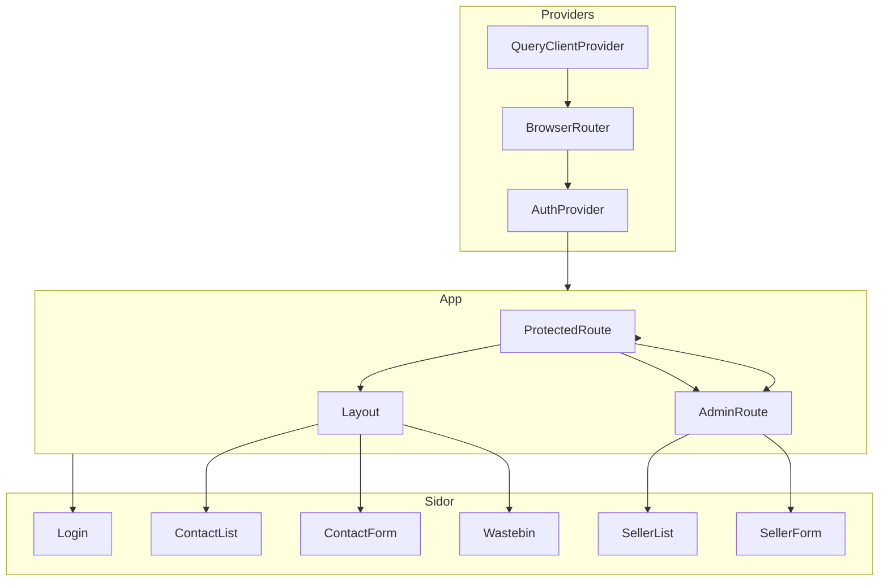

# Frontend – KeepWarm CRM

## Översikt

Frontend är byggd med React 18, Vite, TypeScript, React Router och TanStack Query. Applikationen hanterar kontakter, interaktioner och säljare (för admin) med en mörk tema-design. Tailwind CSS används för styling med en anpassad dark palette (`dark-400`, `dark-700`, `dark-800`, `dark-950`).

## Arkitektur

Appen bygger på providers: QueryClientProvider, BrowserRouter och AuthProvider. Inuti skyddas sidor av ProtectedRoute som omdirigerar till login om användaren inte är inloggad. AdminRoute används för säljarhantering och kräver rollen admin. Layout wrappar sidorna med TopNav och Outlet.

Routing: `/login` är öppen för alla. Inloggade användare når `/contacts` (ContactList), `/contacts/new` (ContactForm), `/contacts/wastebin` (Wastebin). Admin når `/sellers`, `/sellers/new` och `/sellers/:id/edit` (SellerList, SellerForm).

## State och API

AuthContext håller `user`, `isLoading`, `login` och `logout`. Den validerar token mot `/api/me`. apiClient lagrar JWT i localStorage och skickar `Authorization: Bearer <token>` på alla API-anrop. TanStack Query används för contacts, interactions, sellers och auth med dedikerade hooks som `useContacts`, `useCreateContact`, `useUpdateContact`, `useDeleteContact`, `useWastebinContacts`, `useRestoreContact`, `usePermanentDeleteContact`, samt motsvarande för interactions och sellers.

## Komponenter

Layout wrappar sidorna med TopNav och Outlet. InlineEditable hanterar inline-redigering för text, e-post, telefon, datum, tid, select och textarea. InlineEditableLinkedIn normaliserar LinkedIn-URL till användarnamn. InlineEditableDateWithQuickActions ger följupp-datum med snabbval. ContactTable är en expanderbar lista med kontakter, interaktioner och inline-redigering. NewInteractionRow är formuläret för nya interaktioner. Övriga komponenter: EmptyState, Card, Button, SearchInput, LoadingSpinner, Badge, Avatar, BackButton. Navigering definieras i `config/navigation.tsx` med `navItems` (Contacts, Wastebin) och `adminItems` (Sellers).
