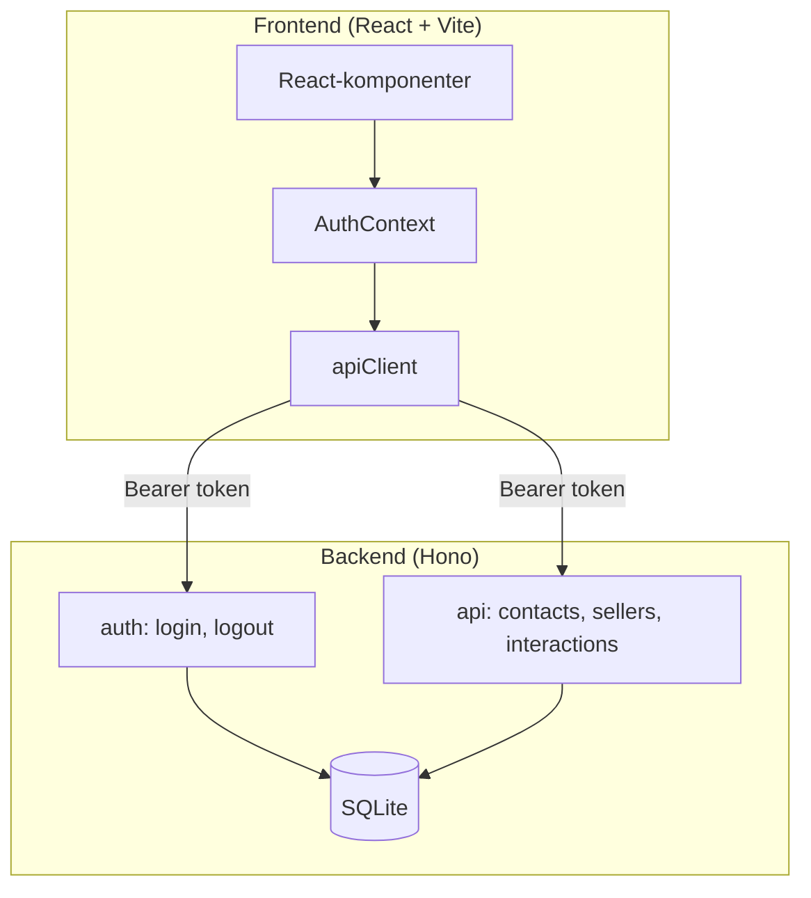

# KeepWarm CRM – Projektöversikt

KeepWarm är ett CRM-system (Customer Relationship Management) för säljare att hantera kontakter och uppföljningar. Projektet består av en React-frontend och en Hono-baserad backend med SQLite.

## Arkitektur

## Projektstruktur

| Mapp | Innehåll |
|------|----------|
| `frontend/` | React-app med Vite, TanStack Query, Tailwind |
| `backend/` | Hono API, Drizzle ORM, SQLite |
| `autodocs/` | Genererad dokumentation |

## Teknisk stack

- **Frontend:** React 19, React Router 7, TanStack Query, Tailwind CSS 4, Vite 6
- **Backend:** Hono, Drizzle ORM, better-sqlite3, Argon2 (lösenord)
- **Tester:** Vitest (enhet), Playwright (e2e)

## Roller

- **Admin:** Hanterar säljare, ser alla kontakter, återställer databas (dev)
- **Seller:** Ser endast egna kontakter och interaktioner

## Skript

- `npm run dev` (backend/frontend) – Startar respektive app separat
- `npm test` – Kör alla tester (backend unit, frontend unit, e2e)
- `npm run lint` – Biome lint

---

## FAQ

**Vad är KeepWarm?**  
KeepWarm är ett CRM för säljare att spåra kontakter och planera uppföljningar. Säljare ser bara sina egna kontakter medan admins har full åtkomst.

**Vad menas med wastebin?**  
Wastebin är papperskorgen där mjuka borttagna kontakter hamnar. Kontakter kan återställas eller raderas permanent därifrån.
