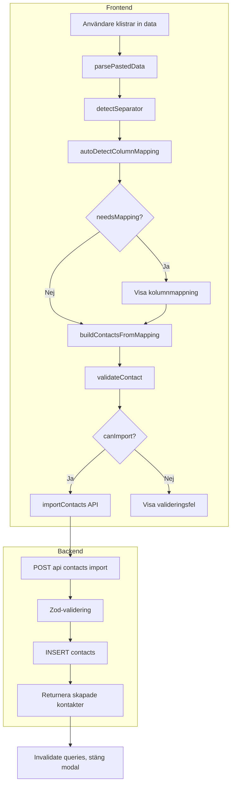

# Import-kontakter

Import-funktionen låter användare klistra in data från Excel eller Google Sheets och skapa flera kontakter på en gång. Data tolkas som tabellformat med rubrikrad och valfri kolumnmappning.

## Översikt

Flödet går från klistrad text → parsning → kolumnmappning → validering → API-anrop. Alla kontakter kopplas till den inloggade säljaren.

## Komponenter

| Del | Plats | Ansvar |
|-----|-------|--------|
| **ImportContactsModal** | `frontend/src/pages/contacts/ImportContactsModal.tsx` | UI: textarea, mappning, felmeddelanden |
| **importContacts utils** | `frontend/src/utils/importContacts.ts` | Parsning, mappning, validering |
| **API** | `frontend/src/api/contacts.ts` | `importContacts()`, `useImportContacts()` |
| **Backend** | `backend/src/routes/contacts.ts` | `POST /api/contacts/import` |

## Flöde

## Parsning och mappning

- **Separator**: Tab, semicolon eller komma detekteras automatiskt utifrån första raden.
- **Rubrikrad**: Första raden tolkas som rubriker om den inte ser ut som rent numerisk data.
- **Kolumnmappning**: `HEADER_ALIASES` matchar rubriker mot fält (t.ex. "namn", "Namn", "contact" → `name`). Stöd för svenska och engelska.
- **Obligatoriskt fält**: Endast `name` krävs. Övriga fält kan hoppas över.

## Validering

| Fält | Regler |
|------|--------|
| name | Obligatoriskt, får inte vara tomt |
| email | Om angivet: giltigt e-postformat |
| linkedin | Om angivet: giltig LinkedIn-URL (linkedin.com/in/...) |
| followUpDate | Om angivet: format YYYY-MM-DD |

## API

**POST** `/api/contacts/import`

- **Body**: `{ contacts: CreateContactData[] }`
- **Auth**: Bearer-token krävs
- **Response**: `{ contacts: Contact[], count: number }` (201)
- Kontakter skapas med `sellerId` från inloggad användare.

## FAQ

**Vad är kolumnmappning?**  
Kolumnmappningen kopplar kolumner i den klistrade datan till kontaktfält (namn, e-post, telefon, etc.). Systemet försöker automatiskt gissa mappningen utifrån rubriknamn, men användaren kan redigera den manuellt.

**Vilka format stöds för datum?**  
Endast `YYYY-MM-DD` (t.ex. 2025-02-23). Andra format ger valideringsfel och måste korrigeras innan import.
