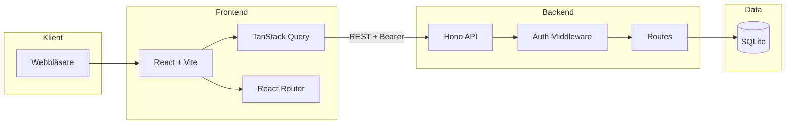

# KeepWarm CRM – Systemöversikt

## Instructions for AI

This document should be around 400 rows.

## Syfte

KeepWarm är ett CRM (Customer Relationship Management) byggt för säljare som behöver hantera kontakter och interaktioner i sin vardag. Systemet låter säljare hålla koll på sina leads, boka följupp-möten och logga samtal, möten och e-post. Administratörer kan skapa och hantera säljare, medan kontakter kan soft-deletas till en "wastebin" och återställas vid behov.

## Arkitektur

Systemet bygger på en klassisk trelagerarkitektur där webbläsaren ansluter till en React-frontend, som i sin tur pratar med en Hono-baserad backend via REST-API. All data lagras i SQLite.



Användaren loggar in via inloggningssidan `/login`; frontend skickar credentials till `POST /auth/login` och får tillbaka en sessionstoken. Token lagras i localStorage och skickas i `Authorization: Bearer`-headern på alla API-anrop. Skyddade sidor kontrolleras av `ProtectedRoute` som omdirigerar till inloggning om ingen token finns. Backend validerar varje request via `authMiddleware` som slår upp sessionen i databasen. Rollbaserad åtkomst säkerställer att säljare endast ser sina egna kontakter och interaktioner, medan admin har full åtkomst och kan hantera säljare.

## Projektstruktur

Projektet är uppdelat i `frontend/`, `backend/` och `scripts/`. Dokumentationen ligger i `autodocs/`.

### Frontend (`frontend/`)

- **`src/`** – Huvudkällkod
  - **`api/`** – API-klient och hooks: `client.ts` (Bearer-token, fetch-wrapper), `auth.ts`, `contacts.ts`, `interactions.ts`, `sellers.ts`, `types.ts`
  - **`components/`** – Återanvändbara komponenter: `Layout.tsx`, `TopNav.tsx`, samt `ui/` med Button, Card, Input, Select, Badge, Avatar, LoadingSpinner, EmptyState, SearchInput, BackButton, ErrorMessage, Textarea och inline-redigeringskomponenter
  - **`config/`** – Konfiguration: `navigation.tsx` (navItems, adminItems), `interactions.tsx` (typer), `config.ts`
  - **`context/`** – AuthContext för användarstate och login/logout
  - **`hooks/`** – useInlineEdit, useFormSubmission
  - **`pages/`** – Sidor: `Login.tsx`, `contacts/` (ContactList, ContactForm, Wastebin), `sellers/` (SellerList, SellerForm), `interactions/` (NewInteractionRow, InteractionForm)
  - **`utils/`** – dates, clock, errors, styles, interactions
  - **`App.tsx`** – Routing, ProtectedRoute, AdminRoute
  - **`main.tsx`** – Entry point med providers
- **`e2e/`** – Playwright e2e-tester
- **`vite.config.ts`**, **`vitest.config.ts`** – Build och test

### Backend (`backend/`)

- **`src/`** – Huvudkällkod
  - **`db/`** – `schema.ts` (tabeller), `index.ts` (migrationer, reset), `seed.ts`
  - **`middleware/`** – `auth.ts` (authMiddleware, adminOnly, createSession, deleteSession, hashPassword)
  - **`routes/`** – `auth.ts`, `contacts.ts`, `interactions.ts`, `sellers.ts`, `helpers.ts`
  - **`app.ts`** – Hono-app, CORS, middleware, route-mounting
  - **`index.ts`** – Serverstart, migrationer, seed
  - **`constants.ts`** – Felmeddelanden, roller, session- och Argon2-konfiguration
- **`tests/`** – Vitest för auth, contacts, interactions, sellers
- **`drizzle.config.ts`** – Drizzle ORM-konfiguration

### Scripts och tester

- **`scripts/`** – Diverse skript (t.ex. e2e-relaterade)
- **Root** – `npm test` kör tester för backend, frontend och e2e

## Autentisering och flöde

### Inloggning

1. Användaren fyller i email och lösenord på `/login`
2. Frontend skickar `POST /auth/login` med JSON-body
3. Backend validerar med Zod, slår upp användare i `users`, verifierar lösenord med Argon2
4. Vid lyckad verifiering: `createSession` skapar rad i `sessions` med token och `expiresAt`, returnerar token + user
5. Login-sidan sparar token i `apiClient.setToken()` (localStorage) och anropar `login(token, user)` i AuthContext
6. AuthContext rensar QueryClient-cache och sätter upp user-state
7. Navigering till `/` (index) → `/contacts`

### Skyddade sidor

- `ProtectedRoute` kontrollerar `user` från AuthContext; om `isLoading` visas spinner, om `!user` redirect till `/login`
- `AdminRoute` kräver `user.role === 'admin'`; annars redirect till `/`
- Varje API-anrop: `apiClient` lägger till `Authorization: Bearer <token>`
- `authMiddleware` extraherar token, slår upp session i `sessions` med JOIN till `users`, kräver `expiresAt > now`; vid ogiltig session: HTTPException 401

### Utloggning

- `logout()` anropar `POST /auth/logout` (invaliderar session), rensar token och user, rensar QueryClient

## Datamodell (översikt)

- **users** – id, email, password_hash, name, role (admin|seller)
- **sessions** – token, user_id, expires_at
- **contacts** – seller_id, name, email, phone, company, linkedin (användarnamn), follow_up_date, deleted_at (soft delete)
- **interactions** – contact_id, seller_id, type (call|meeting|email|video_call|note), date, time, notes

Relationer: users → sessions, users → contacts, users → interactions, contacts → interactions. ON DELETE CASCADE på alla FKs.

## Sidor och flöden

### Kontakter

- **ContactList** (`/contacts`) – Lista med sökning, filter, sortering. Knappen "Import" öppnar ImportContactsModal för CSV-import. Kontakter visas i expanderbara rader (expand/collapse). Inline-redigering av namn, företag, email, telefon, LinkedIn, följupp-datum. Varje kontakt kan ha interaktioner; nya interaktioner läggs till via NewInteractionRow. Delete → soft delete (deleted_at sätts).
- **ContactForm** (`/contacts/new`) – Formulär för att skapa ny kontakt. Redigering sker inline i ContactList.
- **Wastebin** (`/contacts/wastebin`) – Lista över soft-deletade kontakter. Sökning, expand/collapse. Återställ (restore) eller permanent delete.

### Säljare (admin)

- **SellerList** (`/sellers`) – Lista över säljare. Endast för admin.
- **SellerForm** (`/sellers/new`, `/sellers/:id/edit`) – Skapa eller redigera säljare.

### Rollbaserad åtkomst

- Säljare: ser endast egna kontakter och interaktioner (`sellerId === user.id`)
- Admin: ser alla, kan hantera säljare, kan använda `POST /api/dev/reset` (endast i utvecklingsläge)

## API-flöden (sammanfattning)

| Endpoint | Metod | Beskrivning |
|----------|-------|-------------|
| `GET /health` | - | Health check, publik |
| `POST /auth/login` | - | Login, returnerar token + user |
| `POST /auth/logout` | - | Invaliderar session (token i header) |
| `GET /api/me` | Bearer | Returnerar inloggad användare |
| `GET/POST/PUT/DELETE /api/contacts` | Bearer | CRUD för kontakter |
| `POST /api/contacts/bulk` | Bearer | Bulk-import av kontakter (CSV) |
| `GET /api/contacts/wastebin` | Bearer | Soft-deletade kontakter |
| `POST /api/contacts/:id/restore` | Bearer | Återställ från wastebin |
| `DELETE /api/contacts/:id/permanent` | Bearer | Permanent radering |
| `GET/POST/PUT/DELETE /api/interactions` | Bearer | CRUD för interaktioner |
| `GET/POST/PUT/DELETE /api/sellers` | Bearer | CRUD för säljare (admin) |
| `POST /api/dev/reset` | Bearer | Reset + seed (admin, dev) |

Validering: Zod-scheman för create/update. Datumformat `YYYY-MM-DD`. LinkedIn normaliseras till användarnamn. HTTPException för 401/403/404/500.

## Komponenter och moduler

### Inline-redigering

- **InlineEditable** – Text, email, tel med klick → redigera → spara
- **InlineEditableDate** – Datum
- **InlineEditableDateWithQuickActions** – Följupp-datum med snabbval (t.ex. "+1 vecka")
- **InlineEditableTime** – Tid
- **InlineEditableSelect** – Typ (t.ex. interaktionstyp)
- **InlineEditableTextarea** – Anteckningar
- **InlineEditableLinkedIn** – Normaliserar LinkedIn-URL till användarnamn

Alla använder `onSave` som triggar mutation (t.ex. `useUpdateContact.mutateAsync`).

### Layout och navigation

- **Layout** – Wrapper med TopNav och Outlet
- **TopNav** – Navigeringslänkar (Contacts, Wastebin, Sellers för admin), logout
- **config/navigation.tsx** – `navItems`, `adminItems` för menyn

### Övriga UI-komponenter

- `Card`, `Button`, `Input`, `Select`, `Textarea`, `SearchInput`, `Badge`, `Avatar`, `LoadingSpinner`, `EmptyState`, `BackButton`, `ErrorMessage`

### Hooks och API

- **useContacts**, **useCreateContact**, **useUpdateContact**, **useDeleteContact**
- **useWastebinContacts**, **useRestoreContact**, **usePermanentDeleteContact**
- **useInteractions**, **useCreateInteraction**, **useUpdateInteraction**, **useDeleteInteraction**
- **useSellers**, **useCreateSeller**, **useUpdateSeller**, **useDeleteSeller**
- **useLogin**, **getCurrentUser**

Alla använder TanStack Query för cache och mutationer.

## Nyckelfunktioner

- **CSV-import** – Säljare kan importera flera kontakter via CSV med kolumnmappning, förhandsvisning och duplicatkontroll (se `autodocs/import-contacts.md`)
- **Inline-redigering** – Kontakter och interaktioner redigeras direkt i listan utan separata formulär
- **Följupp-datum med snabbval** – "+1 vecka", "+2 veckor" etc. för snabb planering
- **LinkedIn-normalisering** – Automatisk extrahering av användarnamn från full URL
- **Soft delete** – Kontakter flyttas till wastebin; kan återställas eller permanent raderas
- **Admin-hantering** – Skapa, redigera och radera säljare
- **Utvecklingsläge** – `POST /api/dev/reset` återställer och seedar databas; Quick Login och Reset Database på inloggningssidan (när developer tools är aktiverade)

## Start och körning

- **Backend**: `cd backend && npm run dev` – port 3000. `SEED_DB=true` seedar vid start.
- **Frontend**: `cd frontend && npm run dev` – Vite på port 5173.
- **Tester**: `npm test` i root – backend unit, frontend unit, e2e.

## Miljövariabler

- **Backend**: `PORT`, `NODE_ENV`, `SEED_DB`
- **Frontend**: `VITE_API_URL` (API base URL)

## Testning

- **Backend**: Vitest i `backend/tests/` – auth, contacts, interactions, sellers
- **Frontend**: Vitest för utils och komponenter
- **E2E**: Playwright i `frontend/e2e/` – contact-add, contact-edit, contact-delete, contact-wastebin, contact-followup-date, contact-add-interaction, contact-import

## Säkerhet

- Lösenord hashas med Argon2
- Sessionstokens lagras i `sessions` med utgångsdatum
- Bearer token krävs för alla `/api/*`-endpoints
- Rollbaserad åtkomst: säljare ser endast egna data; admin har full åtkomst
- `adminOnly`-middleware för säljarhantering och dev-reset
- CORS aktiverat globalt
- Zod-validering på alla inputs

## Teknisk stack

| Lager | Teknik |
|-------|--------|
| Frontend | React 18, Vite, TypeScript, React Router, TanStack Query, Tailwind CSS |
| Backend | Hono, Node.js, Drizzle ORM, SQLite |
| Auth | Argon2 (hash), sessionstokens (Bearer) |
| Validering | Zod, @hono/zod-validator |
| E2E | Playwright |

## Mermaid-diagram

Arkitekturdiagrammet ovan visar dataflödet: Browser → React → TanStack Query → Hono (REST + Bearer) → SQLite. Ytterligare detaljer finns i `autodocs/backend.md`, `autodocs/frontend.md` och `autodocs/databas.md`.

## Kontaktflöde i detalj

### Skapa kontakt

1. Användaren klickar "Add Contact" på ContactList
2. Navigering till `/contacts/new`
3. ContactForm visar formulär med namn, email, telefon, företag, LinkedIn, följupp-datum
4. Vid submit: `useCreateContact.mutateAsync` → `POST /api/contacts` med sellerId från inloggad användare
5. Backend validerar med Zod, skapar rad i `contacts`, returnerar skapad kontakt
6. TanStack Query invaliderar `contacts`-query, listan uppdateras
7. Navigering tillbaka till `/contacts` eller till den nya kontaktens sida

### Redigera kontakt inline

1. På ContactList expanderar användaren en kontakt
2. Klick på inline-fält (t.ex. namn, email) aktiverar redigeringsläge
3. Vid blur eller Enter: `onSave` anropas med nytt värde
4. `useUpdateContact.mutateAsync({ id, data })` → `PUT /api/contacts/:id`
5. Backend uppdaterar rad, returnerar uppdaterad kontakt
6. Query cache uppdateras, UI re-renderas

### Lägga till interaktion

1. I expanderad kontakt visas NewInteractionRow
2. Användaren väljer typ (call, meeting, email, video_call, note), datum, tid, anteckningar
3. Vid submit: `useCreateInteraction.mutateAsync` → `POST /api/interactions` med contactId, sellerId
4. Interaktionen visas direkt i listan under kontakten
5. Interaktioner sorteras efter recency (senaste först)

### Soft delete och wastebin

1. Användaren klickar "Delete" på en kontakt
2. `useDeleteContact.mutate(id)` → `DELETE /api/contacts/:id`
3. Backend sätter `deleted_at = now()` istället för att radera raden
4. Kontakten försvinner från ContactList, dyker upp i Wastebin
5. I Wastebin: "Restore" → `POST /api/contacts/:id/restore` (sätter deleted_at = null)
6. "Delete Permanently" → `DELETE /api/contacts/:id/permanent` (faktisk radering, cascade till interaktioner)

## Säljarflöde (admin)

1. Admin navigerar till `/sellers`
2. SellerList visar alla säljare med useSellers
3. "Add Seller" → `/sellers/new`, SellerForm med email, namn, lösenord
4. `useCreateSeller.mutateAsync` → `POST /api/sellers`; backend hashar lösenord med Argon2
5. Redigering: `/sellers/:id/edit`, `PUT /api/sellers/:id`
6. Radering: `DELETE /api/sellers/:id` – cascade raderar sessions, contacts, interactions

## Sortering och filtrering

- **Kontakter**: `sortContacts` – primärt på follow_up_date (null sist), sekundärt på namn
- **Interaktioner**: `sortInteractionsByRecency` – senaste först (datum + tid)
- **Sökning**: Client-side filter på name, company, email, linkedin (case-insensitive)

## Felhantering

- **Frontend**: `getErrorMessage` från utils extraherar felmeddelande från API-svar eller nätverksfel
- **Backend**: `HTTPException` med status 401/403/404/500; `onError`-handler returnerar JSON med `{ error: string }`
- **TanStack Query**: `onError` i mutationer kan visa toast eller ErrorMessage-komponent

## Developer tools

När `config.developerTools` är true (typiskt i utveckling):

- **Quick Login** – Knappar för att logga in som Admin, Maria eller Lars med förifyllda credentials
- **Backend status** – Indikator som visar om backend svarar på `/health`
- **Reset database** – Knapp som loggar in som admin, anropar `POST /api/dev/reset`, loggar ut – återställer databasen till seed-state

## Seed-data

Med `SEED_DB=true` eller via `POST /api/dev/reset` seedas:

- Användare: admin (admin@keepwarm.com), Maria, Lars (säljare)
- Kontakter kopplade till Maria och Lars
- Interaktioner kopplade till kontakter

Lösenord för seed-användare finns i seed-filen (t.ex. admin123, seller123).

## Filer och beroenden

### Frontend-paket (urval)

- react, react-dom, react-router-dom
- @tanstack/react-query
- vite, typescript
- tailwindcss
- playwright (dev)

### Backend-paket (urval)

- hono, @hono/node-server
- drizzle-orm, better-sqlite3
- @node-rs/argon2
- zod, @hono/zod-validator
- vitest (dev)

## Konfigurationsfiler

- **frontend/vite.config.ts** – Vite, proxy till API vid behov
- **frontend/playwright.config.ts** – E2E-konfiguration
- **backend/drizzle.config.ts** – Drizzle schema, migrations
- **backend/vitest.config.ts**, **frontend/vitest.config.ts** – Test-konfiguration

## Routing-struktur

```
/login                    → Login (publik)
/                         → ProtectedRoute → Layout
  index                   → Redirect till /contacts
  /contacts               → ContactList (inline-redigering)
  /contacts/new           → ContactForm (skapa ny)
  /contacts/wastebin      → Wastebin
  /sellers                → AdminRoute → SellerList
  /sellers/new            → AdminRoute → SellerForm (create)
  /sellers/:id/edit       → AdminRoute → SellerForm (edit)
```

## API-klient och token

- `apiClient` (från `api/client.ts`) hanterar base URL, token i localStorage
- `setToken(token)` – sparar/rensar token
- `getToken()` – returnerar aktuell token
- Alla requests (get, post, put, delete) lägger automatiskt till `Authorization: Bearer <token>` om token finns
- Vid 401 kan frontend rensa token och redirecta till login (beroende på implementation)

## Migreringar

- Drizzle migrations körs vid serverstart via `runMigrations()` i `backend/src/index.ts`
- Migrations-filer genereras med `drizzle-kit generate`
- Vid `resetDatabase()` körs drop + create på nytt från schema

## ContactForm och InteractionForm

ContactForm används endast för att skapa nya kontakter via `/contacts/new`. Formuläret innehåller fält för namn, email, telefon, företag, LinkedIn och följupp-datum. `useFormSubmission` hanterar submit, validering och felmeddelanden. Vid lyckad skapande navigeras användaren tillbaka till kontaktlistan.

Redigering av befintliga kontakter sker inline i ContactList via InlineEditable-komponenter. NewInteractionRow används för att lägga till nya interaktioner direkt i den expanderade kontaktraden. InteractionForm finns för redigering av befintliga interaktioner.

## InlineEditable-mönster

Alla InlineEditable-komponenter följer samma mönster:

1. Visar nuvarande värde (eller placeholder/emptyText)
2. Vid klick: byter till input/textarea/select
3. Vid blur eller Enter: anropar onSave med nytt värde
4. onSave triggar mutation (t.ex. useUpdateContact.mutateAsync)
5. Vid lyckad mutation: komponenten visar uppdaterat värde
6. Vid fel: felmeddelande visas, användaren kan försöka igen

useInlineEdit-hook kan användas för att hantera edit-state (visa/dölj input).

## Tailwind och tema

Frontend använder Tailwind med anpassad dark palette: `dark-400`, `dark-700`, `dark-800`, `dark-900`, `dark-950` för bakgrunder och text. `warm-400` till `warm-600` används för accentfärger (knappar, länkar, badges). Komponenter använder `cn()` från utils för att slå ihop klassnamn.

## Relaterad dokumentation

- **autodocs/backend.md** – API-struktur, endpoints, middleware
- **autodocs/frontend.md** – Komponenter, routing, state
- **autodocs/databas.md** – Schema, tabeller, relationer
- **autodocs/import-contacts.md** – CSV-import av kontakter (flöde, validering, API)

## Sammanfattning

KeepWarm är ett fokuserat CRM för säljare med inline-redigering, soft delete, rollbaserad åtkomst och enkel deployment (SQLite, ingen extern databas). Arkitekturen är tydlig: React + TanStack Query på frontend, Hono + Drizzle på backend, session-baserad auth med Bearer tokens.
