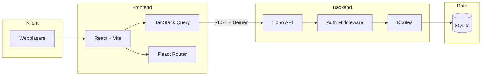

# KeepWarm CRM – Systemöversikt

## Instructions for AI

This document should be around 400 rows.

## Syfte

KeepWarm är ett CRM (Customer Relationship Management) byggt för säljare som behöver hantera kontakter och interaktioner i sin vardag. Systemet låter säljare hålla koll på sina leads, boka följupp-möten och logga samtal, möten och e-post. Administratörer kan skapa och hantera säljare, medan kontakter kan soft-deletas till en "wastebin" och återställas vid behov.

## Arkitektur

Systemet bygger på en klassisk trelagerarkitektur där webbläsaren ansluter till en React-frontend, som i sin tur pratar med en Hono-baserad backend via REST-API. All data lagras i SQLite.

Användaren loggar in via inloggningssidan `/login`; frontend skickar credentials till `POST /auth/login` och får tillbaka en sessionstoken. Token lagras i localStorage och skickas i `Authorization: Bearer`-headern på alla API-anrop. Skyddade sidor kontrolleras av `ProtectedRoute` som omdirigerar till inloggning om ingen token finns. Backend validerar varje request via `authMiddleware` som slår upp sessionen i databasen. Rollbaserad åtkomst säkerställer att säljare endast ser sina egna kontakter och interaktioner, medan admin har full åtkomst och kan hantera säljare.

## Projektstruktur

Projektet är uppdelat i `frontend/` (React-app med Vite), `backend/` (Hono API) och `scripts/` för t.ex. e2e-tester. Frontend innehåller `api/`, `components/`, `pages/`, `context/`, `config/`, `hooks/` och `utils/`. Backend har `db/` för schema, migrationer och seed, `middleware/` för auth, samt `routes/` för API-endpoints. Dokumentationen ligger i `autodocs/`.

Backend startas med `npm run dev` i `backend/` (port 3000). Med miljövariabeln `SEED_DB=true` seedas databasen vid start med testdata. Frontend körs med `npm run dev` i `frontend/` (Vite på port 5173). Tester körs med `npm test` i root och täcker backend, frontend unit och e2e.

## Nyckelfunktioner

KeepWarm erbjuder inline-redigering av kontakter och interaktioner direkt i listan, vilket gör att säljaren inte behöver öppna separata formulär för små ändringar. Följupp-datum har snabbval som t.ex. "+1 vecka" för att spara tid. LinkedIn-länkar normaliseras automatiskt till användarnamn. Soft delete med wastebin gör att raderade kontakter kan återställas. Admin kan skapa, redigera och radera säljare. I utvecklingsläge finns `POST /api/dev/reset` för att återställa databasen.
