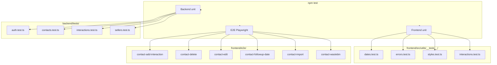

# KeepWarm CRM – Testdokumentation

## Syfte

Projektet har tre typer av tester: backend unit-tester (Vitest), frontend unit-tester (Vitest) och end-to-end-tester (Playwright). Alla körs via `npm test` från projektroten.

## Testöversikt



## Backend-tester (Vitest)

**Plats:** `backend/tests/`  
**Kör:** `cd backend && npm run test` (watch) eller `npm run test:run` (en körning)

### Setup

- `setup.ts` – Skapar in-memory SQLite-databas, seedar testdata (admin, två säljare, kontakter, interaktioner, sessioner)
- `TestContext` – Innehåller `app`, `db`, tokens (`adminToken`, `sellerToken`, `seller2Token`) och IDs
- Hjälpfunktioner: `get`, `post`, `put`, `del`, `expectOk`, `expectCreated`, `expectNotFound`, `expectForbidden`, `expectUnauthorized`, `expectBadRequest`

### Testfiler

| Fil | Beskrivning |
|-----|-------------|
| `auth.test.ts` | Login, logout, session, ogiltiga credentials |
| `contacts.test.ts` | CRUD kontakter, rollbaserad åtkomst, wastebin, restore, permanent delete, bulk-import |
| `interactions.test.ts` | CRUD interaktioner, åtkomst per säljare |
| `sellers.test.ts` | CRUD säljare (admin), åtkomstkontroll |

## Frontend unit-tester (Vitest)

**Plats:** `frontend/src/utils/__tests__/`  
**Kör:** `cd frontend && npm run test` (watch) eller `npm run test:run`

### Testfiler

| Fil | Beskrivning |
|-----|-------------|
| `dates.test.ts` | `getTodayISO`, `getCurrentTimeHHMM`, `formatDate`, `addDaysFromToday`, `addWorkDaysFromToday`, `addMonthsFromToday` |
| `errors.test.ts` | `getErrorMessage` – extrahering av felmeddelanden från API-svar och nätverksfel |
| `styles.test.ts` | `cn()` – klassnamnssammanslagning |
| `interactions.test.ts` | `sortInteractionsByRecency`, interaktionstyp-hantering |

## E2E-tester (Playwright)

**Plats:** `frontend/e2e/`  
**Kör:** Backend och frontend måste vara igång (`npm run dev`). Sedan: `cd frontend && npm run test:e2e`

### Kommandon

| Kommando | Beskrivning |
|----------|-------------|
| `npm run test:e2e` | Kör alla e2e-tester (headless) |
| `npm run test:e2e:headed` | Öppnar webbläsare |
| `npm run test:e2e:ui` | Visuell interaktiv debugger |
| `npm run test:e2e:debug` | Stega interaktivt |
| `npm run test:e2e:trace` | Interaktiv rapport med skärmdumpar |
| `npm run test:e2e:codegen` | Skapa tester grafiskt |

### Testfiler och scenarier

| Fil | Tester |
|-----|--------|
| `contact-add-interaction.spec.ts` | Lägga till interaktion till kontakt |
| `contact-delete.spec.ts` | Permanent radering från wastebin |
| `contact-edit.spec.ts` | Redigera kontakt inline |
| `contact-followup-date.spec.ts` | Sätt följupp-datum |
| `contact-import.spec.ts` | Import happy path, ogiltig rad, duplicat i preview, tom fil |
| `contact-wastebin.spec.ts` | Soft delete, återställ från wastebin |

### E2E-mönster

- Använder Quick Login och Reset database för att säkerställa ren state
- Semantiska selectors: `getByRole`, `getByLabel`, `getByText` (se `.cursor/rules/e2e-selectors.mdc`)
- Scopade selectors till dialoger: `page.getByRole('dialog').getByRole('button', ...)`

## Körning från projektroten

```bash
npm test
```

Kör i ordning: backend unit → frontend unit → e2e. E2E startar backend och frontend automatiskt via `scripts/run-e2e.mjs`.

## Konfiguration

- **Backend:** `backend/vitest.config.ts` – Vitest för Node
- **Frontend:** `frontend/vitest.config.ts` – Vitest för Vite (exkluderar e2e)
- **E2E:** `frontend/playwright.config.ts` – Playwright mot `http://localhost:5173`

## Relaterad dokumentation

- **autodocs/oversikt.md** – Systemöversikt, inkl. testsektion
- **.cursor/rules/e2e-selectors.mdc** – Riktlinjer för e2e-selectors
