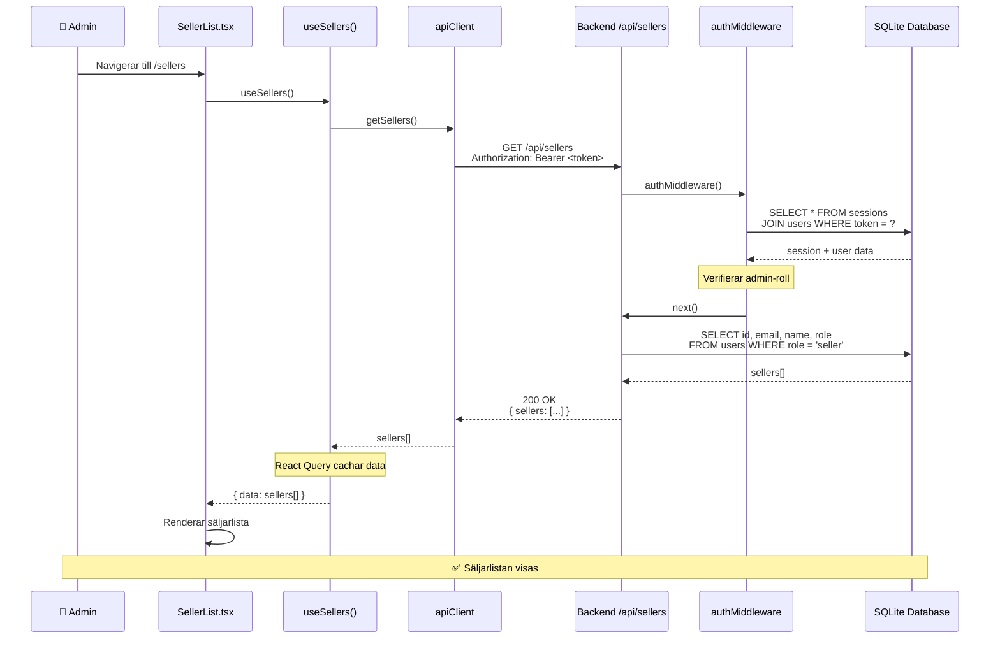

# Dataflöde: Lista alla säljare (Admin)

## Sekvensdiagram

## Involverade filer

| Lager | Fil | Funktion |
|-------|-----|----------|
| Frontend | `pages/sellers/SellerList.tsx` | Komponent som renderar listan |
| Frontend | `api/sellers.ts` | `useSellers()` hook och `getSellers()` |
| Frontend | `api/client.ts` | HTTP-klient med auth header |
| Backend | `app.ts` | Routar `/api/*` till protected routes |
| Backend | `middleware/auth.ts` | `authMiddleware()` validerar token |
| Backend | `middleware/auth.ts` | `adminOnly()` kräver admin-roll |
| Backend | `routes/sellers.ts` | `GET /sellers` endpoint |

## Sammanfattning

1. **Komponent renderas** → `SellerList.tsx` anropar `useSellers()`
2. **React Query** → Kontrollerar cache, gör fetch om data saknas/är stale
3. **API-klient** → Lägger till `Authorization: Bearer <token>` header
4. **authMiddleware** → Validerar token mot sessions-tabellen
5. **adminOnly** → Kontrollerar att användaren har `role: 'admin'`
6. **Databasquery** → Hämtar alla användare med `role: 'seller'`
7. **Response** → Returnerar `{ sellers: [...] }` (utan passwordHash!)
8. **Caching** → React Query cachar med key `['sellers']`
9. **Rendering** → Listan visas med filtrering på klientsidan

