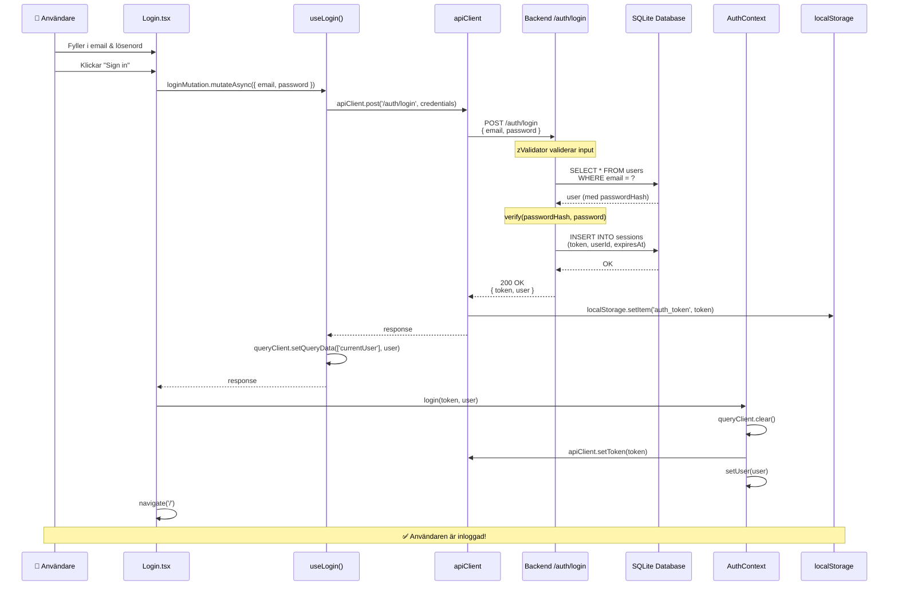

# Inloggningsflöde: maria@sellmore.se

## Sekvensdiagram

## Sammanfattning

1. **Användarinteraktion** → formuläret i `Login.tsx`
2. **Frontend-lagret** → `useLogin()` hook → `apiClient` 
3. **Nätverksanrop** → POST till backend
4. **Backend-logik** → validering, databassökning, lösenordsverifiering, sessionskapande
5. **Response-hantering** → token sparas i localStorage och React state uppdateras
6. **Omdirigering** → användaren skickas till startsidan
