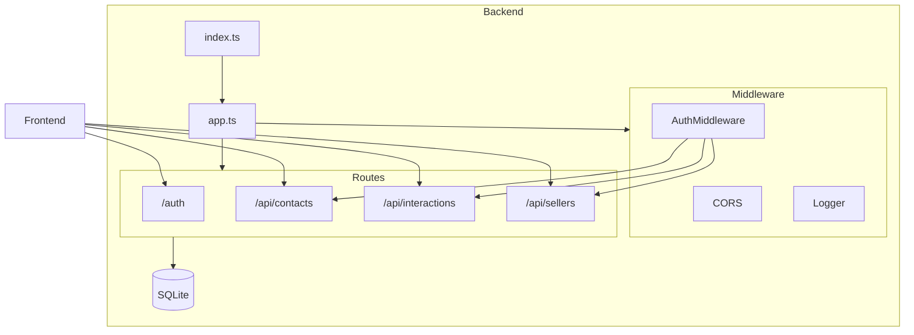

# Backend 

## Syfte

Översikt av backend-API:t i KeepWarm CRM.

## Översikt

Backend är en REST API-server som hanterar autentisering, kontakter, interaktioner och säljare. Den använder Hono som webbramverk och SQLite med Drizzle ORM för datalagring. Alla skyddade routes monteras under `/api` och kräver Bearer-token.

### Teknisk stack

- **Hono** – webbramverk
- **@hono/node-server** – HTTP-server
- **Drizzle ORM** – databasåtkomst
- **better-sqlite3** – SQLite-driver
- **@node-rs/argon2** – lösenordshashing
- **Zod** – validering av in- och utdata
- **@hono/zod-validator** – request-validering

---

## API-endpoints

### Öppna (utan auth)

| Metod | Sökväg | Beskrivning |
|-------|--------|-------------|
| GET | `/health` | Health check (returnerar `{ status, timestamp }`) |
| POST | `/auth/login` | Logga in, returnerar token |
| POST | `/auth/logout` | Logga ut (invalidera session) |

### Skyddade (kräver Bearer-token)

| Metod | Sökväg | Beskrivning |
|-------|--------|-------------|
| GET | `/api/me` | Hämta inloggad användare |
| GET | `/api/contacts` | Lista kontakter |
| GET | `/api/contacts/wastebin` | Lista borttagna kontakter |
| POST | `/api/contacts` | Skapa kontakt |
| GET | `/api/contacts/:id` | Hämta kontakt |
| PUT | `/api/contacts/:id` | Uppdatera kontakt |
| DELETE | `/api/contacts/:id` | Mjuk borttagning (wastebin) |
| POST | `/api/contacts/:id/restore` | Återställ borttagen kontakt |
| DELETE | `/api/contacts/:id/permanent` | Permanent borttagning |
| GET | `/api/interactions` | Lista interaktioner (filtrera på contactId) |
| GET | `/api/interactions/:id` | Hämta interaktion |
| POST | `/api/interactions` | Skapa interaktion |
| PUT | `/api/interactions/:id` | Uppdatera interaktion |
| DELETE | `/api/interactions/:id` | Ta bort interaktion |
| GET | `/api/sellers` | Lista säljare (admin) |
| GET | `/api/sellers/:id` | Hämta säljare (admin) |
| POST | `/api/sellers` | Skapa säljare (admin) |
| PUT | `/api/sellers/:id` | Uppdatera säljare (admin) |
| DELETE | `/api/sellers/:id` | Ta bort säljare (admin) |
| POST | `/api/dev/reset` | Återställ och seed databas (admin, endast dev) |

---

## Autentisering

- **Bearer-token:** Klienten skickar `Authorization: Bearer <token>` i varje skyddat anrop.
- **Sessioner:** Token lagras i tabellen `sessions` med utgångstid. Vid login skapas en ny session.
- **Roller:** `admin` ser alla kontakter och kan hantera säljare; `seller` ser endast egna kontakter.
- **authMiddleware:** Validerar token, hämtar användare och sätter `c.set('user', ...)` för skyddade routes.

---

## Konfiguration

| Variabel | Beskrivning | Standard |
|----------|-------------|----------|
| `PORT` | Serverport | `3000` |
| `DB_PATH` | Sökväg till SQLite-fil | `./data/keepwarm.db` |
| `SEED_DB` | `true` = återställ och seed vid start | - |
| `NODE_ENV` | `production` inaktiverar `/dev/reset` | - |

---

## Kommandon

| Kommando | Beskrivning |
|----------|-------------|
| `npm run dev` | Startar dev-server med tsx watch |
| `npm run dev:seed` | Startar med databasåterställning och seed |
| `npm run build` | Bygger TypeScript till `dist/` |
| `npm start` | Kör produktionsserver |
| `npm run test` | Kör Vitest-tester |
| `npm run db:generate` | Genererar migrationer |
| `npm run db:migrate` | Kör migrationer |
| `npm run db:seed` | Kör seed |

---

## FAQ

**Vilken roll har Hono i projektet?**  
Hono är webbramverket som bygger hela REST API:t. Det används för routing (GET, POST, PATCH, DELETE), middleware (CORS, logger, auth) och request/response-hantering. Tillsammans med `@hono/node-server` startar Hono HTTP-servern på Node.js och hanterar alla inkommande anrop till backend.

**På vilket sätt används Zod i projektet?**  
Zod används för validering av request-body vid POST, PUT och PATCH. Via `@hono/zod-validator` kopplas Zod-scheman (t.ex. `createContactSchema`, `loginSchema`) till routes med `zValidator('json', schema)`. Vid ogiltig data returneras automatiskt 400 med felmeddelanden innan route-handlern körs.
