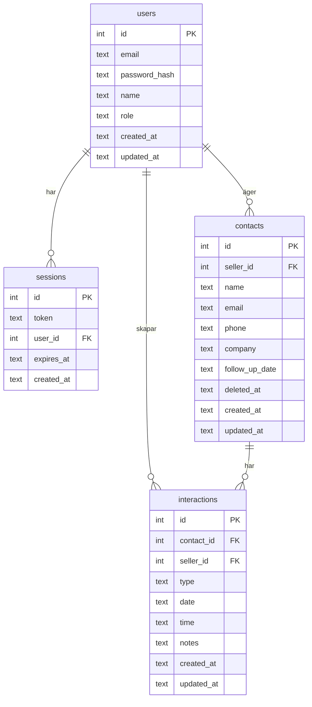

# Databasen – KeepWarm CRM

## Syfte

Dokumentation av databasarkitekturen i KeepWarm-projektet.

## Översikt

Projektet använder **SQLite** som databas tillsammans med **Drizzle ORM**. Databasen lagras som en fil (`keepwarm.db`) i mappen `backend/data/`.

### Teknisk stack

- **Databas:** SQLite (via `better-sqlite3`)
- **ORM:** Drizzle ORM
- **Migrationer:** Drizzle Kit



---

## Databasschema

### Tabeller

| Tabell | Beskrivning |
|--------|-------------|
| `users` | Användare (säljare och admins) med email, lösenordshash, namn och roll |
| `sessions` | Inloggningssessioner med token och utgångstid |
| `contacts` | Kontakter (namn, email, telefon, företag, follow-up-datum) kopplade till säljare. Stöd för mjuk borttagning via `deleted_at` |
| `interactions` | Interaktioner (call, meeting, email, video_call, note) kopplade till kontakter med datum, tid och anteckningar |

### Relationer

- **users → sessions:** En användare kan ha flera sessioner (cascade delete)
- **users → contacts:** En säljare äger sina kontakter (cascade delete)
- **contacts → interactions:** En kontakt har flera interaktioner (cascade delete)
- **users → interactions:** Interaktioner är kopplade till både kontakt och säljare (cascade delete)

### Schema-definition

Schemat definieras i `backend/src/db/schema.ts` med Drizzle ORM. Detta är den **enda källan** för tabellstrukturen – migrationer genereras utifrån denna fil.

---

## Migrationer

### Hur migrationer fungerar

1. **Schema-first:** Du ändrar `schema.ts` när du vill uppdatera databasen.
2. **Generera:** Drizzle Kit jämför schema med befintliga migrationer och skapar nya SQL-filer.
3. **Köra:** Migrationerna appliceras mot databasen (antingen vid start eller manuellt).

### Migrationsmappen

Alla migrationer finns i `backend/src/db/migrations/` med filer som `0000_init.sql` och meta-filer i `meta/`.

### Migrationsflöde

```
schema.ts  →  drizzle-kit generate  →  migrations/*.sql  →  migrate()  →  databas
```

1. **Redigera** `backend/src/db/schema.ts`
2. **Generera** ny migration: `npm run db:generate` (i backend-mappen)
3. **Applicera** – migrationer körs automatiskt vid serverstart (anropas från `backend/src/index.ts`, funktionen definieras i `backend/src/db/index.ts`)

### Manuella kommandon

| Kommando | Beskrivning |
|----------|-------------|
| `npm run db:generate` | Genererar nya migrationer utifrån ändringar i `schema.ts` |
| `npm run db:migrate` | Kör migrationer via Drizzle Kit CLI |
| `npm run db:seed` | Kör seed direkt (utan att starta servern) |

Drizzle håller reda på vilka migrationer som körts i tabellen `__drizzle_migrations`.

### Databasåterställning

Funktionen `resetDatabase()` i `backend/src/db/index.ts` droppar alla tabeller, droppar `__drizzle_migrations` och kör migrationer igen. Används för utveckling eller tester.

---

## Konfiguration

### Miljövariabler

| Variabel | Beskrivning | Standard |
|----------|-------------|----------|
| `DB_PATH` | Sökväg till databasfilen | `./data/keepwarm.db` (relativt backend) |

### Drizzle-konfiguration

`backend/drizzle.config.ts` anger dialect (sqlite), schema (`./src/db/schema.ts`), out (`./src/db/migrations`) och dbCredentials.url.

### SQLite-inställningar

Vid anslutning sätts `journal_mode = WAL` och `foreign_keys = ON`.

---

## Seed

För att fylla databasen med testdata:

```bash
cd backend
npm run db:seed
```

eller vid serverstart (återställer databasen och seedar):

```bash
npm run dev:seed
```

eller `SEED_DB=true npm run dev` – då körs `resetDatabase()` först, sedan seed.

Seed-logiken finns i `backend/src/db/seed.ts` och rensar befintlig data innan den infogar ny. Skapar admin, säljare, kontakter och interaktioner med deterministisk testdata.

---

## Tester

### Enhetstester (backend)

Backend-testerna använder `createMigratedDatabase(':memory:')` i `backend/src/db/index.ts` för att skapa en temporär databas i minnet, köra migrationer och returnera en fristående db-instans. Detta håller testerna isolerade från utvecklingsdatabasen.

Test-setup finns i `backend/tests/setup.ts` med `createTestDatabase()` och `seedTestData()` för att skapa deterministisk testdata.

### E2E-tester (Playwright)

E2E-testerna kör mot hela stacken (frontend + backend) och använder **utvecklingsdatabasen** – alltså filen `keepwarm.db`, inte en memory-databas. Backend måste vara igång (`npm run dev` i backend) för att E2E-testerna ska fungera. Varje test återställer databasen till seed-state via knappen "Reset database" på inloggningssidan innan testet körs, så att alla tester startar från samma deterministiska utgångsläge.

---

## FAQ

**Vad är Drizzle Kit?**  
Drizzle Kit är CLI-verktyget som följer med Drizzle ORM. Det används för att generera migrationer utifrån schema-definitioner och för att köra migrationer mot databasen. Med `drizzle-kit generate` jämförs schema.ts med befintliga migrationer och nya SQL-filer skapas automatiskt.

**Vad är better-sqlite3?**  
better-sqlite3 är en Node.js-binding till SQLite skriven i C++. Den är synkron och snabbare än många andra SQLite-drivrutiner för Node.js. KeepWarm använder better-sqlite3 som databasdrivrutin under Drizzle ORM.
