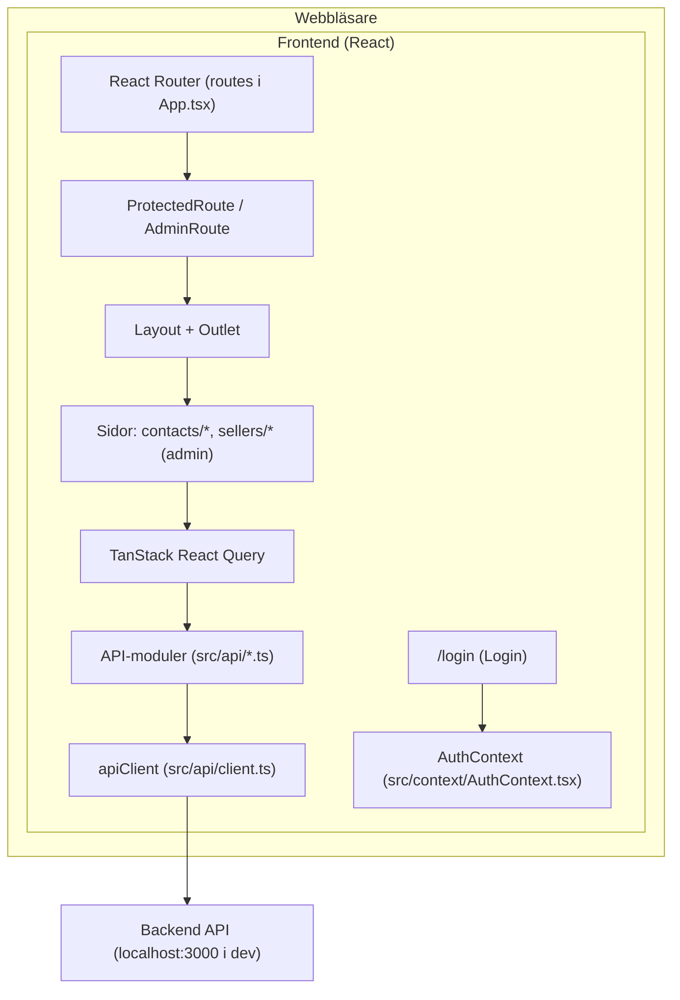

# Frontend – KeepWarm CRM

## Syfte

Översikt av frontendprojektet i KeepWarm CRM.

## Översikt

Frontend är en React-applikation (TypeScript) som hanterar **kontakter**, **interaktioner** och **säljare**. Den pratar med backend via HTTP (REST-liknande JSON-API) och använder **Bearer-token** för autentisering.



### Teknisk stack

- **React 19** med TypeScript
- **Vite 6** – byggverktyg och dev-server
- **React Router 7** (`react-router-dom`) – routing
- **TanStack React Query 5** (`@tanstack/react-query`) – datahämtning och cache
- **Tailwind CSS 4** – styling
- **Vitest** – enhetstester
- **Playwright** – E2E-tester

---

## Projektstruktur

```
frontend/
├── src/
│   ├── api/           # API-klient och datahooks
│   ├── components/    # Återanvändbara komponenter
│   ├── config/        # Navigation, interaktionstyper
│   ├── context/       # AuthContext
│   ├── hooks/         # useInlineEdit, useFormSubmission
│   ├── pages/         # Sidkomponenter (contacts, sellers, interactions)
│   ├── utils/         # clock, dates, errors, styles, interactions
│   ├── App.tsx
│   ├── main.tsx
│   ├── config.ts      # developerTools m.m.
│   ├── constants.ts   # Roller, konstanter
│   └── index.css
├── e2e/               # Playwright E2E-tester
├── vite.config.ts
└── package.json
```

---

## Sidor och routing

| Sökväg | Beskrivning | Åtkomst |
|--------|-------------|---------|
| `/login` | Inloggning | Alla |
| `/contacts` | Kontaktlista | Inloggad |
| `/contacts/new` | Ny kontakt | Inloggad |
| `/contacts/wastebin` | Papperskorg (borttagna kontakter) | Inloggad |
| `/sellers` | Säljarlista | Endast admin |
| `/sellers/new` | Ny säljare | Endast admin |
| `/sellers/:id/edit` | Redigera säljare | Endast admin |

`ProtectedRoute` kräver inloggning; `AdminRoute` kräver dessutom `role === "admin"` (se `src/constants.ts`). Root (`/`) redirectar till `/contacts`. Interaktioner hanteras i UI:t kring kontakter (det finns ingen separat `/interactions`-route).

---

## API och autentisering

### API-klient

`apiClient` i `src/api/client.ts` hanterar alla anrop:

- Token cacheas i minnet och persisteras i `localStorage` under nyckeln `auth_token`
- Vid anrop sätts headern `Authorization: Bearer <token>` när token finns
- Bas-URL sätts via `VITE_API_URL` (tom sträng = relativt, t.ex. när frontend och backend serveras bakom samma origin)

### Proxy (utveckling)

Vite proxar `/api`, `/auth` och `/health` till `http://localhost:3000` så att frontend kan anropa backend utan CORS.

### AuthContext

`AuthProvider` (i `src/context/AuthContext.tsx`) validerar token vid start via `getCurrentUser()` (som anropar `GET /api/me`). `useAuth()` ger `user`, `isLoading`, `login` och `logout`.

- Vid `login(token, user)` rensas React Query-cachen och token sparas
- Vid `logout()` postas `POST /auth/logout` (fel ignoreras), token rensas och React Query-cachen töms

---

## Data och React Query

Varje domän (contacts, interactions, sellers) har egna API-funktioner och hooks:

- `useContacts()`, `useContact(id)` – lista och enskild kontakt
- `useInteractions(contactId?)`, `useInteraction(id)` – interaktioner
- `useSellers()`, `useSeller(id)` – säljare (admin)

Mutations (`useCreateContact`, `useUpdateContact` m.fl.) invaliderar relevanta queries efter lyckat anrop (t.ex. `['contacts']`, `['wastebin']`, `['interactions', { contactId }]`). Default `staleTime` är 5 minuter (se `src/main.tsx`).

---

## Styling

Tailwind CSS 4 med anpassat tema i `index.css`:

- **Font:** Outfit
- **Färgpalett:** warm (gul/amber) och dark (gråskala)
- **Bakgrund:** Mörk gradient (dark-950 → dark-900)

---

## Konfiguration

| Variabel | Beskrivning |
|----------|-------------|
| `VITE_API_URL` | API bas-URL (tom = relativ) |

`src/config.ts` har `developerTools` som togglar utvecklarhjälpmedel på inloggningssidan (snabbinloggning, backend-status, reset av dev-databas).

---

## Kommandon

| Kommando | Beskrivning |
|----------|-------------|
| `npm run dev` | Startar dev-server (port 5173) |
| `npm run build` | Bygger för produktion |
| `npm run preview` | Förhandsgranskar produktionsbygg |
| `npm run test` | Kör Vitest enhetstester |
| `npm run test:run` | Kör Vitest en gång (utan watch/UI) |
| `npm run test:e2e` | Kör Playwright E2E-tester |
| `npm run test:e2e:ui` | Kör E2E-tester med Playwright UI |
| `npm run test:e2e:headed` | Kör E2E-tester med synlig browser |
| `npm run test:e2e:trace` | Kör E2E-tester med trace på |
| `npm run test:e2e:debug` | Kör E2E-tester i debug-läge |
| `npm run test:e2e:codegen` | Genererar E2E-tester mot localhost:5173 |

---

## FAQ

### Vad är AuthContext?

`AuthContext` är en React Context som hanterar autentiseringsläge i appen. Den exponerar `AuthProvider` (som wrappar appen i `main.tsx`) och `useAuth()`. Via `useAuth()` får komponenter tillgång till `user`, `isLoading`, `login` och `logout`. Vid start valideras token via `getCurrentUser()`; vid login/logout rensas token och React Query-cache så att ingen gammal data visas för fel användare.

### Beskriv relation mellan React Query och apiClient

Det är ett lager: **React Query** → **API-funktioner** → **apiClient** → **fetch**. API-funktionerna (t.ex. `getContacts`, `createContact`) i `src/api/` använder `apiClient` för HTTP-anrop. React Query-hooks (t.ex. `useContacts`, `useUpdateContact`) använder dessa funktioner som `queryFn`/`mutationFn`. `apiClient` hanterar token, headers och felhantering; React Query hanterar cache, invalidering och UI-tillstånd.

### Hur används hooks i projektet?

Det finns två typer:

1. **API-hooks** (i `src/api/`): `useContacts`, `useContact`, `useCreateContact`, `useUpdateContact`, `useInteractions`, `useSellers` m.fl. De använder React Query för datahämtning och mutations.
2. **Custom hooks** (i `src/hooks/`): `useInlineEdit` används av InlineEditable-komponenter för klick-redigering; `useFormSubmission` används av ContactForm, SellerForm och InteractionForm för formulärhantering (submit, fel, navigation).

### Kan alla användare ha localStorage och finns det någon fallback?

`localStorage` finns i alla moderna webbläsare. Projektet har ingen fallback – token lagras enbart i `localStorage` via `apiClient`. I privata fönster eller vissa äldre miljöer kan `localStorage` vara begränsad eller blockerad; då fungerar inte inloggning mellan sidladdningar.

### Vad är "staleTime"?

`staleTime` är ett React Query-argument som anger hur länge data räknas som "färsk" innan den markeras som "stale". Medan data är färsk gör React Query ingen ny fetch vid remount eller fokus. I projektet är default `staleTime` 5 minuter (`main.tsx`), vilket minskar onödiga API-anrop.
