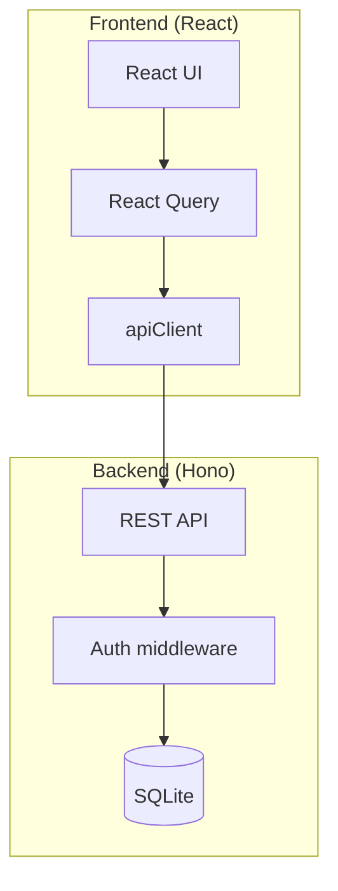

# KeepWarm CRM – Projektöversikt

## Syfte

Ge en översikt av hela projektet

## Översikt

Översikt av hela KeepWarm-projektet, både frontend och backend.

KeepWarm CRM är ett CRM-system för att hantera kontakter och interaktioner. Säljare hanterar sina egna kontakter; administratörer kan hantera alla kontakter och säljare.



---

## Arkitektur

| Del | Teknik | Port |
|-----|--------|------|
| Frontend | React 19, Vite 6, Tailwind 4, React Router 7, TypeScript | 5173 |
| Backend | Hono, Node.js, TypeScript | 3000 |
| Databas | SQLite, Drizzle ORM | - |

Frontend anropar backend via REST. Under utveckling proxar Vite `/api`, `/auth` och `/health` till backend. Autentisering sker med Bearer-token i sessioner. Root-nivå: Biome för lint/format, Husky för pre-commit.

---

## Projektstruktur

```
keepwarm/
├── package.json    # Root: Biome, Husky, lint-staged
├── frontend/       # React-app (Vitest, Playwright E2E)
├── backend/        # Hono API
└── docs/           # Dokumentation
```

---

## Domäner

- **Användare:** admin och seller. Säljare ser endast egna kontakter.
- **Kontakter:** namn, e-post, telefon, företag, uppföljningsdatum. Stöd för mjuk borttagning (wastebin).
- **Interaktioner:** call, meeting, email, video_call, note. Kopplade till kontakter.
- **Säljare:** endast admin kan skapa och redigera säljare.

---

## Starta projektet

```bash
# Backend
cd backend && npm run dev

# Frontend (ny terminal)
cd frontend && npm run dev
```

Med seed-data: `cd backend && npm run dev:seed`

---

## Dokumentation

| Dokument | Innehåll |
|----------|----------|
| [databas.md](databas.md) | Schema, migrationer, seed, tester |
| [frontend.md](frontend.md) | Frontend-arkitektur |
| [backend.md](backend.md) | API, routes, autentisering |

---

## FAQ

**Vad är React?**  
React är ett JavaScript-bibliotek för att bygga användargränssnitt, utvecklat av Meta. Det använder en komponentbaserad arkitektur och Virtual DOM för effektiv rendering. React är ett av de mest populära verktygen för att bygga moderna webbapplikationer.

**Vad är React Query?**  
React Query (TanStack Query) är ett bibliotek för att hantera server-state i React-applikationer. Det förenklar datahämtning, cachelagring och uppdatering av data från API:er. Med React Query undviker man manuell hantering av loading, error och caching.

**Vad är Hono?**  
Hono är ett minimalistiskt, snabbt webbserver-ramverk för JavaScript/TypeScript. Det är designat för edge-miljöer – dvs. körning nära användaren på distribuerade servrar runt om i världen (t.ex. Cloudflare Workers) – men fungerar också på Node.js och andra plattformar. Hono erbjuder en enkel API och tydlig routing för att bygga REST-API:er.

**Vad är SQLite?**  
SQLite är en filbaserad relationell databas som är inbäddad i applikationen. Den kräver ingen separat databasserver – all data lagras i en enda fil. SQLite är perfekt för utveckling, mindre projekt och när man vill ha enkelhet utan att sätta upp PostgreSQL eller MySQL.

**Vad är DrizzleORM?**  
Drizzle ORM är ett TypeScript-ORM-bibliotek som ger typsäkerhet mot databasen. Det är lättviktigt och använder SQL-liknande syntax istället för att abstrahera bort SQL helt. Drizzle fungerar bra med SQLite, PostgreSQL och andra databaser.

**Vad är Vite?**  
Vite är ett modernt build-verktyg för frontend-projekt som använder native ES-moduler i webbläsaren under utveckling. Det ger extremt snabb dev-server och hot module replacement (HMR). Vite använder Rollup för produktion och har minimal konfiguration.

**Vad är Tailwind?**  
Tailwind CSS är ett utility-first CSS-ramverk där man stylar med fördefinierade klasser direkt i HTML. Det ger snabb utveckling utan att växla mellan filer och konsekvent design genom ett designsystem. Tailwind genererar endast den CSS som faktiskt används i projektet.

**Vad är Biome?**  
Biome är ett snabbt allt-i-ett-verktyg för lint och format av JavaScript, TypeScript och JSON. Det ersätter ESLint och Prettier med en enda konfiguration och är skrivet i Rust för hög prestanda. I KeepWarm används Biome på root-nivå för att hålla kodstilen konsekvent.

**Vad är Husky?**  
Husky är ett verktyg som gör det enkelt att köra Git-hooks, t.ex. pre-commit. När du gör en commit kan Husky automatiskt köra lint eller tester innan ändringarna sparas. I KeepWarm används Husky tillsammans med lint-staged för att köra Biome på staged filer vid varje commit.

**Vad är en Bearer-token?**  
En Bearer-token är en autentiseringsmetod där klienten skickar en token i HTTP-headern `Authorization: Bearer <token>`. Servern verifierar token för att avgöra vilken användare som gör anropet. Bearer-tokens används ofta med JWT (JSON Web Tokens) för sessioner och API-autentisering.

**Används JWT i detta projekt?**  
Nej. KeepWarm använder inte JWT utan opaka sessionstokens. Vid inloggning genereras en slumpmässig token som lagras i tabellen `sessions` tillsammans med användar-ID och utgångstid. Servern verifierar token genom att slå upp den i databasen – till skillnad från JWT behöver servern inte dekoda något, bara kontrollera att token finns och inte har gått ut.
