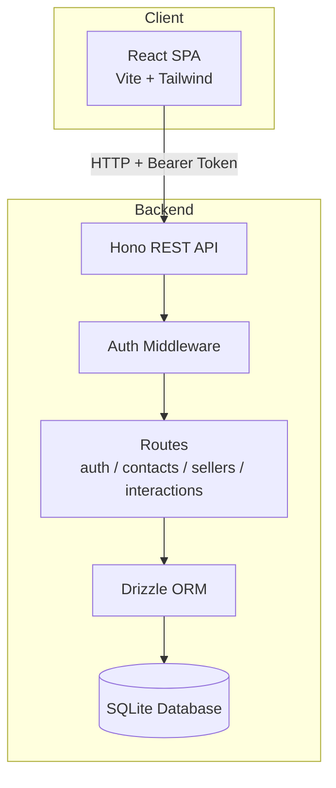

# KeepWarm CRM

## Purpose

KeepWarm CRM is a Customer Relationship Management application designed for sales teams to track and manage their customer contacts and interactions. Sellers can record calls, meetings, emails, video calls, and notes for each contact, while admins have additional capabilities to manage seller accounts. The system supports role-based access control with authentication via bearer tokens.

## Structure

The project is organized as a monorepo with separate `backend` and `frontend` directories, each with their own dependencies and build processes. The backend provides a REST API that the frontend consumes via HTTP requests with token-based authentication. Data is persisted in a SQLite database using Drizzle ORM for type-safe queries.


```mermaid
graph TD
    subgraph Client
        A[React SPA<br/>Vite + Tailwind]
    end
    
    subgraph Backend
        B[Hono REST API]
        C[Auth Middleware]
        D[Routes<br/>auth / contacts / sellers / interactions]
        E[Drizzle ORM]
        F[(SQLite Database)]
    end
    
    A -->|HTTP + Bearer Token| B
    B --> C
    C --> D
    D --> E
    E --> F
```

## Components

| Component | Description |
|-----------|-------------|
| **Authentication** | Session-based auth with bearer tokens, stored in SQLite. Login/logout flows with automatic token validation |
| **Contacts Management** | CRUD operations for customer contacts with soft delete (wastebin). Sellers see their own contacts, admins see all |
| **Interactions** | Track communication history (calls, meetings, emails, video calls, notes) linked to contacts |
| **Seller Management** | Admin-only functionality to create, update, and delete seller accounts |
| **API Client** | Frontend wrapper around fetch with automatic token injection and error handling |
| **AuthContext** | React context providing user state, login/logout functions, and loading states |
| **UI Components** | Reusable components including inline-editable fields, cards, badges, and loading states |

## Technical Choices

| Layer | Technology | Purpose |
|-------|------------|---------|
| **Backend Framework** | Hono | Lightweight, fast web framework with TypeScript support |
| **Database** | SQLite + better-sqlite3 | Simple, file-based database with synchronous driver |
| **ORM** | Drizzle ORM | Type-safe SQL builder with excellent TypeScript integration |
| **Validation** | Zod | Schema validation for API requests |
| **Frontend Framework** | React 19 | UI library with latest features |
| **Routing** | React Router v7 | Client-side routing with protected routes |
| **State Management** | TanStack Query | Server state management with caching |
| **Styling** | Tailwind CSS v4 | Utility-first CSS framework |
| **Build Tool** | Vite | Fast development server and bundler |
| **Password Hashing** | Argon2 (@node-rs/argon2) | Secure password hashing |

## Development Environment

| Requirement | Version |
|-------------|---------|
| Node.js | 18+ |
| Package Manager | npm |

**Backend Setup:**
```bash
cd backend
npm install
SEED_DB=true npm run dev   # First run (seeds database)
npm run dev                 # Subsequent runs
```

**Frontend Setup:**
```bash
cd frontend
npm install
npm run dev
```

## Tools and Packages

### Backend
- `hono` - Web framework
- `@hono/node-server` - Node.js adapter for Hono
- `@hono/zod-validator` - Zod validation middleware
- `drizzle-orm` - Type-safe ORM
- `better-sqlite3` - SQLite driver
- `@node-rs/argon2` - Password hashing
- `zod` - Schema validation
- `tsx` - TypeScript execution
- `vitest` - Unit testing

### Frontend
- `react` / `react-dom` - UI framework
- `react-router-dom` - Client-side routing
- `@tanstack/react-query` - Server state management
- `tailwindcss` - CSS framework
- `vite` - Build tool
- `@vitejs/plugin-react` - React plugin for Vite
- `vitest` - Unit testing
- `@playwright/test` - End-to-end testing

