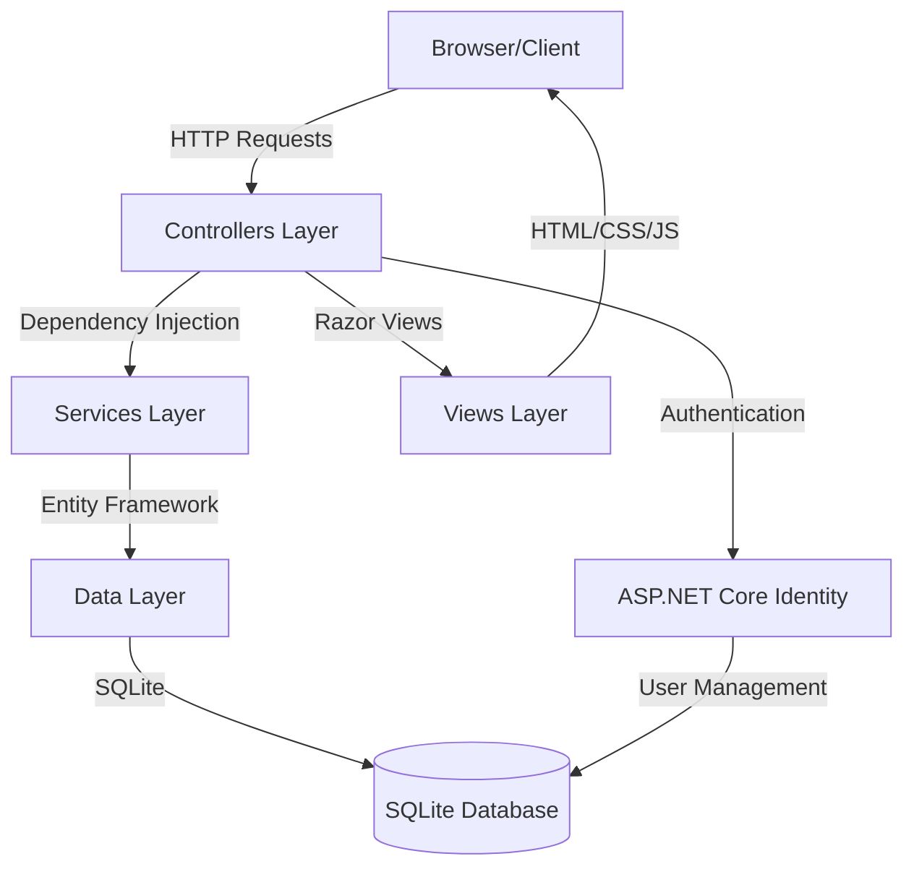

# KeepWarm CRM

## Purpose

KeepWarm is a customer relationship management (CRM) system designed to help users manage their customer contacts and track interactions. The system provides role-based access control with Admin and User roles, allowing users to create, view, edit, and delete their own customers while admins can manage all customers and users in the system. The application focuses on maintaining customer relationships with features like contact information management, LinkedIn profile links, phone number formatting, and interaction history tracking.

## Structure

The project follows a traditional ASP.NET Core MVC architecture with clear separation of concerns across Controllers, Services, Models, and Data layers. The application uses Entity Framework Core for data access with a SQLite database, and ASP.NET Core Identity for authentication and authorization. The codebase is organized into a main application project (KeepWarm) and a comprehensive test suite (KeepWarm.Tests) that includes integration tests for all user stories.

```mermaid
graph TD
    Client[Browser/Client] -->|HTTP Requests| Controllers[Controllers Layer]
    Controllers -->|Dependency Injection| Services[Services Layer]
    Services -->|Entity Framework| Data[Data Layer]
    Data -->|SQLite| Database[(SQLite Database)]
    Controllers -->|Razor Views| Views[Views Layer]
    Views -->|HTML/CSS/JS| Client
    Controllers -->|Authentication| Identity[ASP.NET Core Identity]
    Identity -->|User Management| Database
```

## Components

### Controllers
- **AccountController**: Handles user authentication (login, logout, register) and admin user management (create, edit, delete users)
- **CustomerController**: Manages customer CRUD operations with role-based access control (users see only their customers, admins see all)
- **InteractionController**: Handles interaction CRUD operations (create, edit, delete) for tracking customer contact history (calls, meetings, emails)
- **HomeController**: Provides basic home page and privacy views
- **DeveloperToolsController**: Optional developer utilities (can be disabled via configuration)

### Services
- **CustomerService**: Implements business logic for customer operations, including user-scoped and admin-scoped methods
- **InteractionService**: Manages interaction operations with role-based access control for tracking customer contact history
- **IdentityService**: Wraps ASP.NET Core Identity functionality for user and role management, including role initialization
- **DatabaseSeedService**: Handles database seeding operations

### Models
- **Customer**: Core entity with contact information (name, email, phone, address, LinkedIn URL) and user association
- **Interaction**: Tracks customer interactions (calls, meetings, emails) with date, time, and notes
- **InteractionType**: Enumeration for interaction types (Call, Meeting, Email)
- **ApplicationUser**: Extends IdentityUser with additional fields (FirstName, LastName, timestamps)

### Data Layer
- **ApplicationDbContext**: Entity Framework Core context managing Customer, Interaction, and Identity entities with proper relationships and constraints

### Helpers
- **LinkedInUrlAttribute**: Custom validation attribute for LinkedIn URL format validation
- **PhoneNumberFormatter**: Utility class for formatting phone numbers (supports Swedish and international formats)

### Test Suite
- Comprehensive integration tests organized by user stories (CustomerManagement, UserManagement, InteractionManagement)
- Uses xUnit, Shouldly, and Microsoft.AspNetCore.Mvc.Testing for integration testing
- Test helpers include AuthenticationHelper, TestDataBuilder, and ServiceTestBase

## Technical choices

- **.NET 9.0**: Latest .NET framework version
- **ASP.NET Core MVC**: Web framework for building the application
- **Entity Framework Core 9.0.9**: ORM for database access
- **SQLite**: Lightweight, file-based database
- **ASP.NET Core Identity**: Authentication and authorization framework
- **Bootstrap**: CSS framework for responsive UI
- **jQuery**: JavaScript library for DOM manipulation
- **xUnit**: Testing framework
- **Shouldly**: Fluent assertion library for tests
- **Microsoft.AspNetCore.Mvc.Testing**: Integration testing support

## Development environment

- **.NET SDK**: Version 9.0 or higher
- **Database**: SQLite (customers.db file in project root)
- **IDE**: Compatible with Visual Studio, Visual Studio Code, or Rider
- **Testing Environment**: Supports a "Testing" environment configuration that disables CSRF validation for integration tests

## Tools and Packages

### Main Application (KeepWarm)
- Microsoft.AspNetCore.Identity.EntityFrameworkCore (9.0.9)
- Microsoft.EntityFrameworkCore.Sqlite (9.0.9)
- Microsoft.EntityFrameworkCore.Tools (9.0.9)

### Test Project (KeepWarm.Tests)
- Microsoft.AspNetCore.Mvc.Testing (9.0.10)
- Microsoft.EntityFrameworkCore.InMemory (9.0.10)
- Microsoft.NET.Test.Sdk (17.12.0)
- Shouldly (4.3.0)
- xunit (2.9.2)
- xunit.runner.visualstudio (2.8.2)
- coverlet.collector (6.0.2)

### Frontend Libraries (wwwroot/lib)
- Bootstrap (CSS framework)
- jQuery (JavaScript library)
- jQuery Validation (form validation)
- jQuery Validation Unobtrusive (ASP.NET Core integration)
