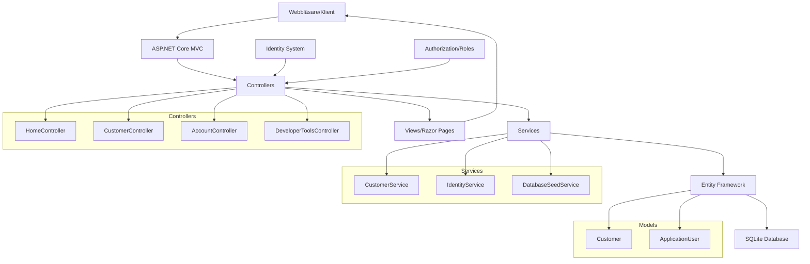

# KeepWarm - CRM för Frilansare

## Syfte

KeepWarm är en CRM-applikation som hjälper frilansare och småföretag att hantera kundkontakter, logga interaktioner och planera uppföljningar. Systemet automatiserar påminnelser och säkerställer att inga affärsmöjligheter går förlorade genom en intuitiv och effektiv kundhantering.

## Struktur

Applikationen är byggd som en ASP.NET Core MVC-webbapplikation med rollbaserad säkerhet. Systemet använder Entity Framework med SQLite-databas och implementerar en tydlig separation mellan presentation, affärslogik och dataåtkomst genom tjänsteskiktet.

## Komponenter

**Controllers**: Hanterar HTTP-förfrågningar och koordinerar mellan vyer och tjänster. Huvudcontrollrar inkluderar CustomerController för kundhantering och AccountController för användarautentisering.

**Services**: Implementerar affärslogik och dataåtkomst. CustomerService hanterar CRUD-operationer för kunder medan IdentityService hanterar användarroller och behörigheter.

**Models**: Definierar datastrukturer. Customer-modellen innehåller kunddata och ApplicationUser utökar Identity-systemets användarmodell.

**Views**: Razor-vyer för presentation av data med separata vyer för kund- och kontohantering.

## Tekniska val

- **Framework**: ASP.NET Core 9.0 MVC
- **Databas**: SQLite med Entity Framework Core
- **Autentisering**: ASP.NET Core Identity
- **Frontend**: Razor Views med Bootstrap CSS
- **Testning**: xUnit med omfattande enhetstester och integrationstester
- **Arkitektur**: MVC-mönster med tjänsteskikt

## Utvecklingsmiljö

Projektet kräver .NET 9.0 SDK och stöder utveckling i Visual Studio, Visual Studio Code eller Rider. SQLite-databasen skapas automatiskt vid första körningen och migrations hanterar databasschema.

## Verktyg och Paket

- **Microsoft.AspNetCore.Identity.EntityFrameworkCore** (9.0.9) - Användarhantering och roller
- **Microsoft.EntityFrameworkCore.Sqlite** (9.0.9) - Databasåtkomst
- **Microsoft.EntityFrameworkCore.Tools** (9.0.9) - Migrations och databasverktyg
- **xUnit** - Testramverk för enhetstester och integrationstester
- **Bootstrap** - CSS-ramverk för responsiv design
- **jQuery** - JavaScript-bibliotek för klientinteraktion
